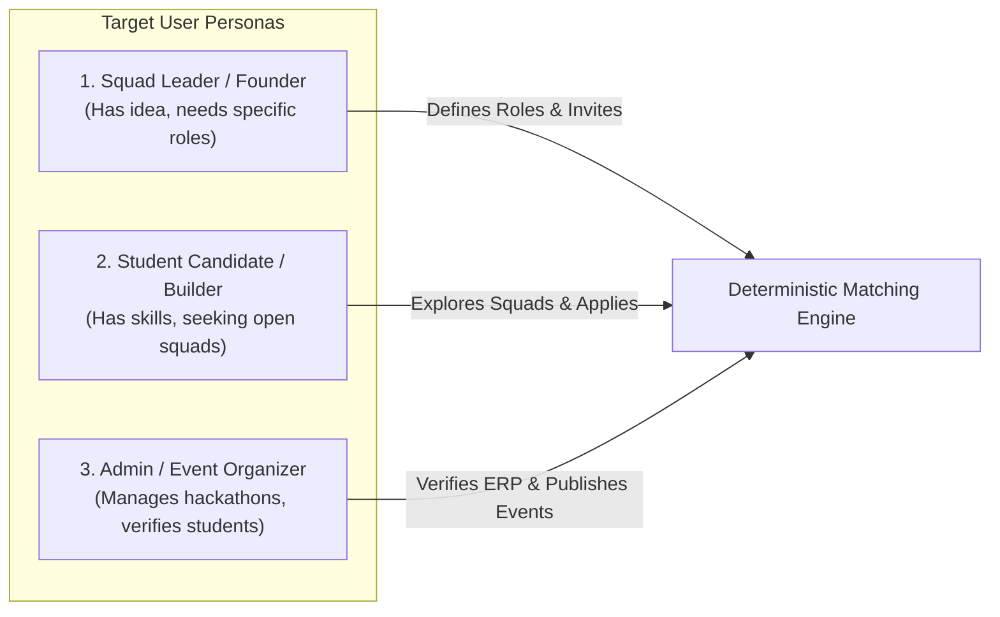
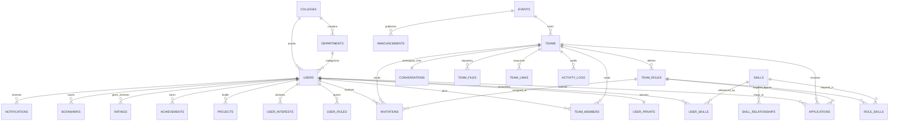
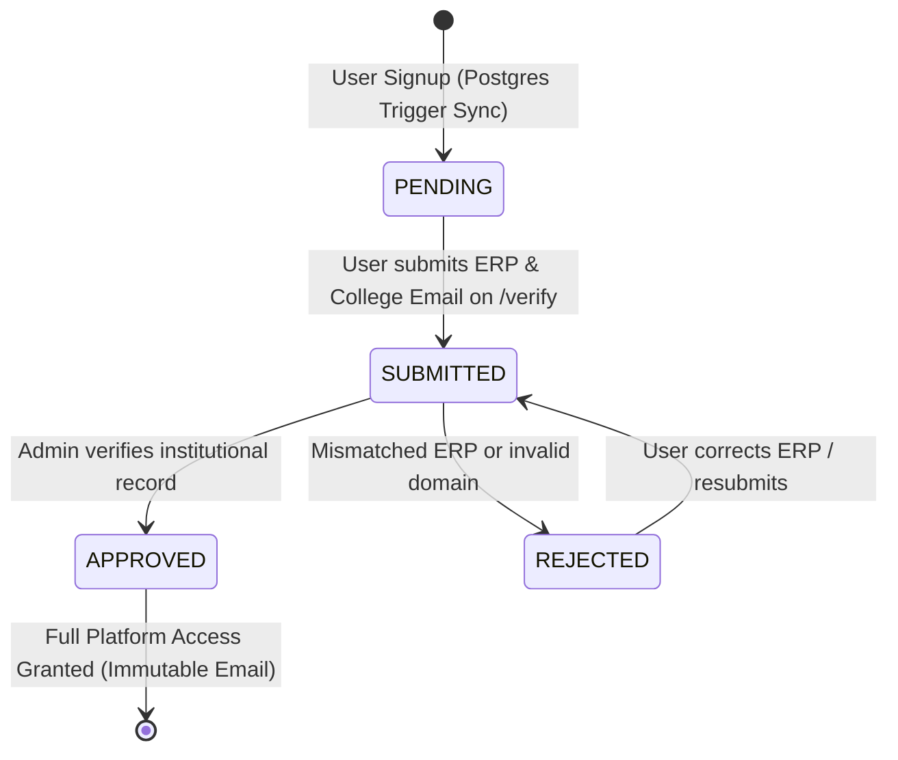
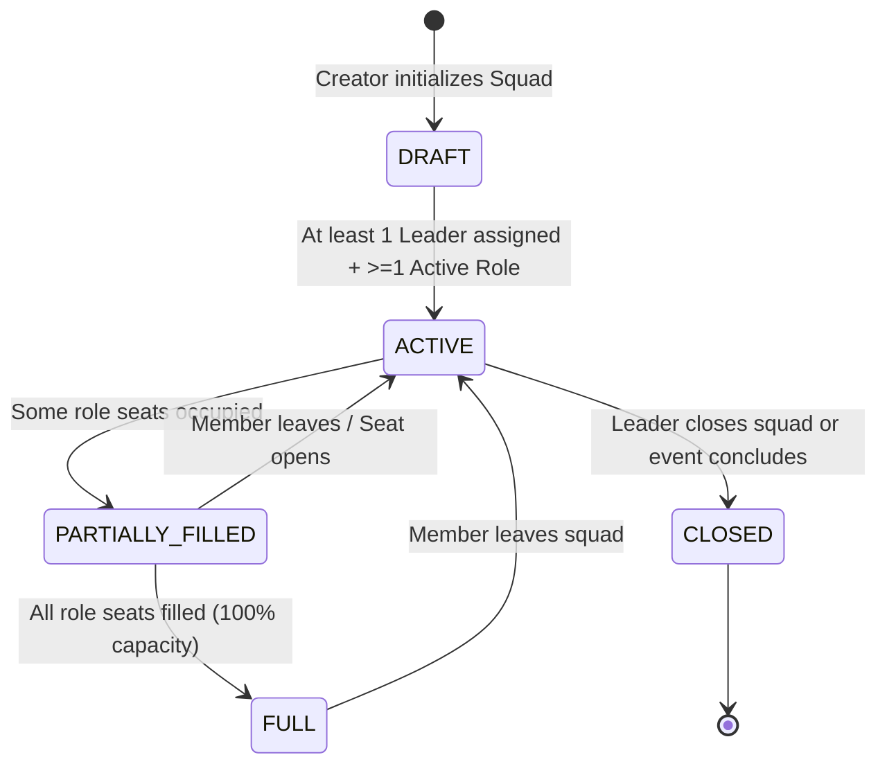
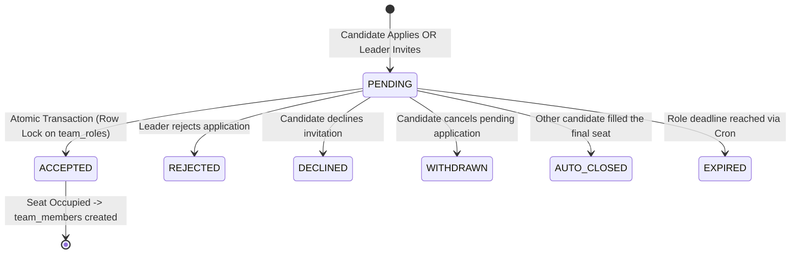

# MASTER PRODUCT VISION — TEAM DISCOVERY PLATFORM
**Document Version:** 1.0 (Authoritative Consolidated Master Specification)  
**Target Platform:** Team Discovery (`team-discovery`)  
**Deployment Target:** Next.js 16 (App Router) + Hosted Supabase PostgreSQL + Vercel Runtime  
**Status:** Authoritative Product Vision & Architecture Reference  

---

# 1. Product Purpose & Executive Vision

### The Core Problem
College hackathons, engineering competitions, capstone projects, and innovation challenges present a chronic, high-friction problem: **forming balanced, high-capability student teams under tight deadlines**.
- Students default to grouping with close friends rather than complementary skill-holders, resulting in teams with duplicate skillsets and critical gaps (e.g., three frontend developers and no backend or UI designer).
- Solo builders and talented underclassmen struggle to discover open teams that genuinely need their specific capabilities.
- Team leaders post unstructured messages on Discord, WhatsApp, and Slack ("Need a backend dev ASAP"), receiving unvetted responses with no verifiable evidence of past work, skill level, or student enrollment.
- Existing general platforms (LinkedIn, GitHub) lack hackathon-specific role constraints, seat capacities, application/invitation concurrency controls, deterministic skill matching, or institutional identity verification.

### The Team Discovery Solution
**Team Discovery is an institutional, skill-anchored team formation and recruitment platform engineered specifically for collegiate hackathons, competitions, and project squads.**

It provides a transparent, deterministic matching and collaboration loop:
$$\text{VERIFY IDENTITY} \longrightarrow \text{DISCOVER CANDIDATES / SQUADS} \longrightarrow \text{EVALUATE EVIDENCE} \longrightarrow \text{APPLY / INVITE} \longrightarrow \text{CONCURRENT SEAT ALLOCATION} \longrightarrow \text{WORKSPACE COLLABORATION} \longrightarrow \text{PEER REPUTATION}$$

---

# 2. Product Boundaries: What Team Discovery IS and IS NOT

$$\begin{array}{|p{7.5cm}|p{7.5cm}|}
\hline
\textbf{What Team Discovery IS} & \textbf{What Team Discovery IS NOT} \\
\hline
\textbf{Role-Anchored Recruitment Engine:} Every team vacancy is defined with explicit required skills, preferred experience, and seat capacity. & \textbf{NOT an Unconstrained Social Network:} No infinite general social feeds, algorithmic vanity engagement, or unstructured messaging channels. \\
\hline
\textbf{Deterministic Match Hierarchy:} Ranks candidates strictly by mathematical skill coverage and verifiable project evidence (Exact > Related > Interest). & \textbf{NOT a Black-Box AI Matcher:} Matching logic is 100\% deterministic, explainable, and transparent to team leaders. \\
\hline
\textbf{Verified Student Platform:} Profiles are anchored to immutable institutional credentials (College Email, ERP) with admin oversight. & \textbf{NOT an Anonymous Forum:} Eliminates fake profiles, spam applications, and duplicate team registrations. \\
\hline
\textbf{Concurrency-Safe Team Builder:} PostgreSQL row-locking guarantees zero seat overbooking and atomic auto-closure of competing applications. & \textbf{NOT a Slack/Discord Substitute:} Focuses on squad formation and lightweight workspace alignment, not enterprise team management. \\
\hline
\textbf{Peer-Validated Reputation System:} Ratings and reviews are restricted exclusively to authenticated peers who completed a team project together. & \textbf{NOT an Unvetted Rating Board:} Eliminates self-ratings, brigading, or arbitrary public reviews. \\
\hline
\end{array}$$

---

# 3. Target User Personas & Core Problems



### Persona 1: Squad Leader / Recruiter
- **Profile:** Student founding a hackathon squad, leading a capstone group, or building a competitive project.
- **Core Need:** Quickly find specific talent (e.g., "1 Advanced Rust developer with 2+ projects and Available status"), evaluate portfolios with verifiable links, and send binding invitations.
- **Key Pain Point:** Wasting hours sifting through unvetted candidate messages; having candidates accept multiple teams simultaneously.

### Persona 2: Student Candidate / Builder
- **Profile:** Software engineer, UI/UX designer, machine learning researcher, or project manager looking for a serious team.
- **Core Need:** Discover teams competing in their target event that have open seats matching their verified skills; showcase project evidence and GitHub repositories.
- **Key Pain Point:** Getting rejected due to lack of network/connections rather than skill merit; missing registration deadlines while looking for teams.

### Persona 3: Institutional Administrator / Event Coordinator
- **Profile:** University department lead, hackathon director, or platform administrator.
- **Core Need:** Verify genuine student enrollment via institutional email and ERP; curate official hackathons; manage taxonomy of skills and domain relationships.

---

# 4. Master Domain Model & Entity Architecture

The database architecture is composed of **29 relational models** and **14 PostgreSQL enums** deployed on PostgreSQL with active Row Level Security (RLS) and integrity constraints:



---

# 5. Core Lifecycles & State Machines

### 5.1 Student Verification Lifecycle


### 5.2 Team & Role Recruitment Lifecycle


### 5.3 Concurrency-Safe Application & Invitation Lifecycle


---

# 6. Matching & Candidate Ranking Engine

The matching engine (`getMatchedCandidatesForRole`) enforces a 2-tier deterministic algorithm:

### Tier 1: Classification Bucketing (Absolute Priority)
Candidates are strictly partitioned into 4 mutually exclusive categories. **No intra-bucket factor (including rating) can ever promote a candidate into a higher bucket.**

1. **`EXACT MATCH` (Tier 1):** Candidate possesses at least one skill tagged as `REQUIRED` in the role specification.
2. **`RELATED MATCH` (Tier 2):** Candidate possesses no exact required skill, but possesses a skill with an established relationship in `skill_relationships` (e.g., PyTorch $\leftrightarrow$ TensorFlow).
3. **`INTEREST ONLY` (Tier 3):** Candidate has neither exact nor related skills, but has declared a matching interest in `user_interests`.
4. **`NO MATCH` (Tier 4):** Excluded entirely from active recommendation lists.

### Tier 2: Deterministic Intra-Bucket Sorting
Within each bucket, candidate ranking is strictly evaluated by:
1. **Required Skill Coverage:** Fraction of required skills satisfied ($3/3 > 2/3 > 1/3$).
2. **Skill-Level Fit:** Closeness to role's `preferred_level` (`ADVANCED` > `INTERMEDIATE` > `BEGINNER`).
3. **Deterministic Experience Fit:** Computed verifiably from completed projects and hackathon achievements:
   - `BEGINNER`: 0 relevant projects.
   - `SOME_EXPERIENCE`: 1 relevant project or achievement.
   - `EXPERIENCED`: $\ge 2$ relevant projects or achievements.
4. **Availability Fit:** Match against `preferred_availability` (`LOOKING_FOR_TEAM` > `AVAILABLE` > `BUSY`).
5. **Relevant Projects Count:** Count of intersecting `project_skills`.
6. **Peer Rating Score:** Aggregate score from `ratings` (tie-breaker only).

---

# 7. Complete User Journeys (30 Reconstructed Workflows)

$$\begin{array}{|c|l|l|l|}
\hline
\textbf{\#} & \textbf{User Journey} & \textbf{Core Interaction} & \textbf{Status in Codebase} \\
\hline
1 & \text{New Student Signup} & \text{Registers via \texttt{/signup} with Name, College Email, Password} & \text{Complete (Supabase SSR)} \\
2 & \text{Email Confirmation} & \text{Confirms account via production domain verification redirect} & \text{Complete} \\
3 & \text{Student Verification} & \text{Navigates \texttt{/verify}; views ERP submission \& verification status} & \text{Complete} \\
4 & \text{Profile Completion} & \text{Edits skills, interests, projects, GitHub links, availability in \texttt{/profile}} & \text{Complete} \\
5 & \text{Discover Teammates} & \text{Leader selects open role on \texttt{/discover} $\rightarrow$ views ranked buckets} & \text{Complete} \\
6 & \text{Global Search} & \text{Presses Cmd+K $\rightarrow$ searches students, squads, projects, events} & \text{Complete} \\
7 & \text{Candidate Portfolio} & \text{Views public portfolio at \texttt{/users/[id]} with verified evidence} & \text{Complete} \\
8 & \text{Create Squad} & \text{Fills team wizard at \texttt{/teams/create} (Name, Desc, Event, Roles)} & \text{Complete} \\
9 & \text{Define Team Roles} & \text{Configures seats, required skills, preferred levels in role modal} & \text{Complete} \\
10 & \text{Find Candidates} & \text{Matches open role against student pool with zero leaks} & \text{Complete} \\
11 & \text{Invite Candidate} & \text{Sends binding invitation modal with custom note to candidate} & \text{Complete} \\
12 & \text{Apply to Squad} & \text{Candidate applies on \texttt{/teams/[id]} with portfolio highlights} & \text{Complete} \\
13 & \text{Leader Review App} & \text{Leader accepts/rejects application with atomic row lock} & \text{Complete} \\
14 & \text{Team Membership} & \text{Member added to roster; seat occupancy updated} & \text{Complete} \\
15 & \text{Workspace Access} & \text{Member enters private collaboration hub at \texttt{/teams/[id]/workspace}} & \text{Complete} \\
16 & \text{Team Chat} & \text{Sends messages in private squad room with realtime updates} & \text{Complete} \\
17 & \text{Team Files} & \text{Shares documents, designs, and resources in file repo} & \text{Complete} \\
18 & \text{Team Links} & \text{Pins Figma, GitHub, and Jira resources in workspace panel} & \text{Complete} \\
19 & \text{Member Management} & \text{Leader views roster, assigns roles, monitors capacity} & \text{Complete} \\
20 & \text{Leave Squad} & \text{Non-leader member voluntarily withdraws via confirmation modal} & \text{Complete (GAP-IMP-01)} \\
21 & \text{Transfer Leadership} & \text{Leader transfers ownership to active teammate atomically} & \text{Backend-Only (GAP-IMP-02)} \\
22 & \text{Delete Vacant Role} & \text{Leader deletes unused recruitment role from team} & \text{Backend-Only (GAP-IMP-03)} \\
23 & \text{Events Directory} & \text{Browses upcoming hackathons and deadlines at \texttt{/events}} & \text{Complete} \\
24 & \text{Event Participation} & \text{Squad registers for event under One-Team-Per-Event constraint} & \text{Complete} \\
25 & \text{In-App Notifications} & \text{Receives alerts for invites, acceptances, auto-closures, events} & \text{Complete} \\
26 & \text{Bookmarks / Saved} & \text{Bookmarks squads, candidates, and projects into sliding drawer} & \text{Complete} \\
27 & \text{Peer Ratings} & \text{Rates verified teammates (1–5 stars) after squad collaboration} & \text{Complete} \\
28 & \text{Admin Moderation} & \text{Admin verifies ERP requests, manages skills taxonomy} & \text{Backend / DB Seed} \\
29 & \text{Role Expiry Cron} & \text{Vercel Cron calls \texttt{/api/cron/expire-roles} to auto-close overdue seats} & \text{Complete} \\
30 & \text{Session Lifecycle} & \text{Secure login, SSR session refresh, and server-side logout} & \text{Complete} \\
\hline
\end{array}$$

---

# 8. Security, Concurrency & Platform Rules

1. **One-Team-Per-Event Constraint:** Enforced via partial unique index:
   ```sql
   CREATE UNIQUE INDEX one_active_team_per_event ON team_members (user_id, event_id)
   WHERE status = 'ACTIVE' AND event_id IS NOT NULL;
   ```
2. **Atomic Seat Allocation:** Application acceptance and invitation acceptance run inside `prisma.$transaction` using `SELECT ... FOR UPDATE` row-level locks on `team_roles`.
3. **Automatic Auto-Closure:** When the final seat of a role is filled, all remaining `PENDING` applications are transitioned to `AUTO_CLOSED` and competing pending invitations are transitioned to `DECLINED`.
4. **Student Email Immutability:** Protected by PostgreSQL trigger `prevent_college_email_update()`.
5. **Private Data Isolation:** Student ERP and institutional email are stored in `public.user_private` and excluded from public search projections.
6. **Server-Side Identity Verification:** All Server Actions execute `supabase.auth.getUser()` on the server; client-supplied user IDs are rejected in production.
