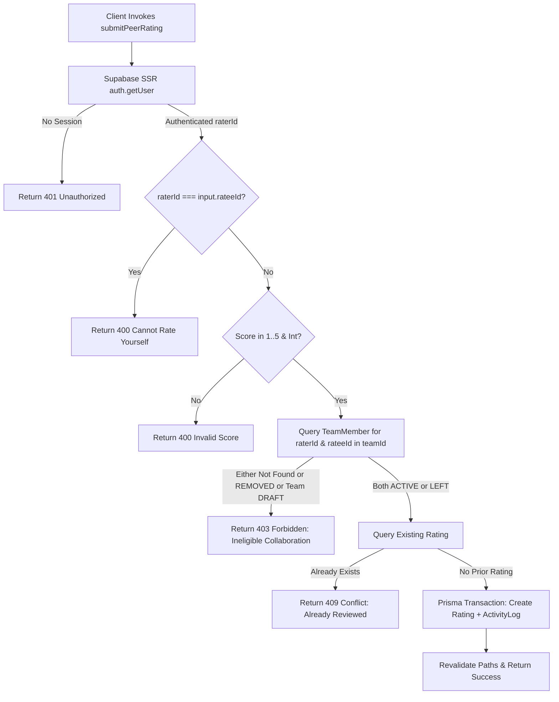

# PHASE 4 STEP 8 — IMPLEMENTATION PLAN
## Peer Review & Ratings UI / Event Showcase

---

## 1. Purpose & Scope

The purpose of Phase 4 Step 8 is to implement:
1. **Peer Review & Rating System:** An authenticated, verifiable peer endorsement mechanism allowing squad members who collaborated together in a team to rate and review each other (1–5 star rating with optional constructive written feedback).
2. **Public Trust Score & Reputation Display:** An aggregated reputation summary on candidate profiles (`/users/[id]`), displaying the average score, total review count, star distribution breakdown (5★–1★), and verified review cards.
3. **Event Showcase (Focused & Secondary):** A lightweight, startup-styled showcase for competitions and hackathons (`/events` and `/events/[id]`) displaying active events, registered squads, open recruitment roles, and participating builders without building unnecessary event-management backend infrastructure.

This feature solidifies the "Team Discovery" startup platform by closing the talent lifecycle:
$$\text{Discover Teammates} \longrightarrow \text{Form Squad} \longrightarrow \text{Collaborate in Workspace} \longrightarrow \text{Review Teammates} \longrightarrow \text{Build Trust \& Reputation}$$

---

## 2. Current Verified Project State

- **Phase 1 (Foundation):** `VERIFIED & COMPLETE` (Next.js 16 App Router, TypeScript, Tailwind CSS v4, shadcn/ui).
- **Phase 2 (Database & Seed):** `VERIFIED & COMPLETE` (27 models, 3 migrations applied, 0 schema drift).
- **Phase 3 (Auth, RLS, Matching, Transactions):** `VERIFIED & COMPLETE` (Supabase SSR auth, raw SQL RLS, 6-tier matching engine, row-level locks).
- **Phase 4 Step 1 (UI Foundation & Design System):** `VERIFIED & COMPLETE` (Responsive AppShell, Navbar, Sidebar, Sonner toast).
- **Phase 4 Step 2 (Auth & Onboarding Screens):** `VERIFIED & COMPLETE` (`/`, `/login`, `/signup`, `/verify`).
- **Phase 4 Step 3 (User Profile & Portfolio UI):** `VERIFIED & COMPLETE` (`/profile`, `/users/[id]`, skills, interests, portfolio projects).
- **Phase 4 Step 4 (Teammate Discovery UI):** `VERIFIED & COMPLETE` (`/discover`, deterministic ranking `EXACT` > `RELATED` > `INTEREST_ONLY`).
- **Phase 4 Step 5 (Teams Catalog & Details):** `VERIFIED & COMPLETE` (`/teams`, `/teams/create`, `/teams/[id]`).
- **Phase 4 Step 6 (Applications & Invitations):** `VERIFIED & COMPLETE` (`/applications`, `/invitations`).
- **Phase 4 Step 7 (Team Collaboration Workspace):** `VERIFIED & COMPLETE` (`/teams/[id]/workspace`).
- **Phase 4 Step 8 (Peer Reviews & Event Showcase):** `NOT STARTED / PLANNED` (Awaiting explicit approval).

**Test Suite Health:** 100/100 automated regression tests passing across 6 suites.

---

## 3. Existing Architecture Relevant to Step 8

### 3.1 Relevant Models in `prisma/schema.prisma`
- **`User`:** Candidate profiles receiving and giving ratings (`ratingsGiven`, `ratingsReceived`).
- **`Team`:** The collaboration container in which team members work together (`status`: `DRAFT`, `ACTIVE`, `FULL`, `CLOSED`; `members: TeamMember[]`, `ratings: Rating[]`).
- **`TeamMember`:** Records user membership in a team (`membershipRole`: `LEADER`, `CO_LEADER`, `MEMBER`; `status`: `ACTIVE`, `LEFT`, `REMOVED`; `joinedAt`, `leftAt`).
- **`Event`:** Hackathons/competitions (`id`, `name`, `description`, `startDate`, `endDate`, `registrationDeadline`, `rules`, `teamSizeInfo`, `bannerUrl`, `status`: `EventStatus`).
- **`Rating`:** The peer review record connecting rater, ratee, team, and optional event ID.
- **`ActivityLog`:** Chronological audit log for team and platform events (`actionType: 'RATING_SUBMITTED'`).

---

## 4. Existing Rating Schema Analysis

The `Rating` model is defined in `prisma/schema.prisma` (lines 512–528) as follows:

```prisma
model Rating {
  id        String   @id @default(uuid()) @db.Uuid
  raterId   String   @map("rater_id") @db.Uuid
  rateeId   String   @map("ratee_id") @db.Uuid
  teamId    String   @map("team_id") @db.Uuid
  eventId   String?  @map("event_id") @db.Uuid
  score     Int      // Constrained 1-5 via DB check constraint
  feedback  String?
  createdAt DateTime @default(now()) @map("created_at")

  rater User @relation("Rater", fields: [raterId], references: [id], onDelete: Cascade)
  ratee User @relation("Ratee", fields: [rateeId], references: [id], onDelete: Cascade)
  team  Team @relation(fields: [teamId], references: [id], onDelete: Cascade)

  @@unique([raterId, rateeId, teamId], name: "one_rating_per_peer_per_team")
  @@map("ratings")
}
```

### Critical Findings & Confirmations:
1. **`eventId` is a SCALAR field:** In the current schema, `eventId` is a nullable scalar string UUID (`String? @map("event_id") @db.Uuid`), **NOT a Prisma relation**. It does not have an `@relation` attribute to `Event`. Server Actions can record the associated `team.eventId` into this field, but Prisma queries must **NEVER** attempt to `include: { event: true }` on `Rating`. If event details are needed, they must be resolved via the `Team` $\rightarrow$ `Event` relation.
2. **Existing Database Constraints:**
   - Primary key: `id` (UUID).
   - Foreign keys: `raterId` $\rightarrow$ `users(id)`, `rateeId` $\rightarrow$ `users(id)`, `teamId` $\rightarrow$ `teams(id)`.
   - Unique compound constraint: `one_rating_per_peer_per_team` on `[raterId, rateeId, teamId]`.
   - Check constraint: `score BETWEEN 1 AND 5`.
3. **Database Migration Requirement:** **NONE (0 migrations / 0 schema changes required).**

---

## 5. FINAL PEER REVIEW ELIGIBILITY RULE

A user must NOT be able to arbitrarily rate any user on the platform. Based on the existing schema (`TeamMember`, `Team`, `Rating`), the strongest, most secure eligibility rule provable by the architecture is defined as follows:

### 5.1 Final Eligibility Definition
A user $U_A$ (Rater) is eligible to rate user $U_B$ (Ratee) in the context of Team $T$ **if and only if ALL of the following 6 conditions are simultaneously satisfied:**

1. **Non-Self-Rating:** The rater and ratee must be distinct users ($U_A \neq U_B$).
2. **Valid Team Lifecycle State:** Team $T$ must NOT be in `DRAFT` status (must be `ACTIVE`, `FULL`, or `CLOSED`).
3. **Rater Membership Status:** $U_A$ must have a verified `TeamMember` record in Team $T$ with `status IN ('ACTIVE', 'LEFT')`.
4. **Ratee Membership Status:** $U_B$ must have a verified `TeamMember` record in Team $T$ with `status IN ('ACTIVE', 'LEFT')`.
5. **Strict Misconduct Disqualification:** Neither $U_A$ nor $U_B$ may have `status: 'REMOVED'` in Team $T$. Any member removed/kicked for misconduct is permanently barred from giving or receiving reviews for that team.
6. **Uniqueness / No Duplicate Review:** $U_A$ must not have an existing `Rating` record for $U_B$ in Team $T$ (enforced by `one_rating_per_peer_per_team`).

### 5.2 Rationale for `ACTIVE` vs `LEFT` Members
- **Why `ACTIVE` members are eligible:** Active teammates are actively collaborating within the squad workspace and forming project builds.
- **Why `LEFT` members remain eligible:** In hackathon and startup team lifecycles, a teammate who completed their role milestone and left the team gracefully (`status: LEFT`) possesses legitimate collaboration experience with their peers.
- **Why `REMOVED` members are disqualified:** Involuntary removal signifies conflict or breach of team conduct, disqualifying the removed user from influencing peer trust metrics.
- **Schema Boundary Limitation:** The existing schema proves verified membership tenure via `TeamMember.joinedAt` and `leftAt`. It does not record per-file commit counts or individual line edits. Therefore, verified concurrent membership in a non-draft team represents the strongest mathematically provable collaboration signal supported by the database.

---

## 6. Authentication & Authorization Model

### 6.1 Zero Client-Trust Principle
- Production Server Actions must **NEVER** accept or trust a caller-provided user ID (e.g., no `providedUserId?: string` in production signatures).
- The authenticated identity is retrieved directly and immutably from the Supabase SSR session:
  ```ts
  const supabase = await createClient()
  const { data: { user } } = await supabase.auth.getUser()
  if (!user) {
    return { error: 'Unauthorized. Please log in.' }
  }
  const raterId = user.id
  ```

### 6.2 Authorization Flow in Server Action


---

## 7. Rating Business Rules

1. **Score Bounds:** Must be an integer $s \in \{1, 2, 3, 4, 5\}$.
2. **Written Feedback:**
   - **Decision:** Written feedback is **OPTIONAL**.
   - **Constraint:** When provided, feedback is trimmed and capped at a maximum of 1,000 characters.
3. **Immutability:** Once submitted, ratings cannot be edited or deleted by regular users, preventing retaliatory rating manipulation.
4. **Audit Logging:** Every rating submission creates an `ActivityLog` entry:
   `actionType: 'RATING_SUBMITTED'`, `description: "{rater.name} submitted a peer review for {ratee.name}"`.
5. **Secondary Trust Signal:** Ratings serve strictly as a peer validation trust signal. They do **NOT** modify or distort the core skill-matching engine hierarchy:
   $$\text{EXACT MATCH} > \text{RELATED MATCH} > \text{INTEREST ONLY} > \text{NO MATCH (EXCLUDED)}$$

---

## 8. Trust Score & Aggregation Rules

### 8.1 Aggregate Trust Score Formula
For a given candidate user $U$:
- Let $R = \{ r \in \text{ratingsReceived} \mid r.\text{rateeId} = U.\text{id} \}$.
- Total count: $N = |R|$.
- If $N = 0$:
  - `stats.totalRatings = 0`
  - `stats.avgRating = null` (UI presents *"No peer reviews yet"* / *"New Builder"*).
- If $N > 0$:
  $$\text{avgRating} = \text{round}\left(\frac{1}{N} \sum_{r \in R} r.\text{score}, 1\right)$$
  - Formatted to 1 decimal place (e.g., `4.8`).

### 8.2 Star Distribution Breakdown
The system calculates frequency counts and percentage widths for 1★ through 5★:
$$\text{count}(k) = |\{ r \in R \mid r.\text{score} = k \}| \quad \text{for } k \in \{5, 4, 3, 2, 1\}$$
$$\text{percentage}(k) = \begin{cases} \text{round}\left(\frac{\text{count}(k)}{N} \times 100\right) & \text{if } N > 0 \\ 0 & \text{if } N = 0 \end{cases}$$

### 8.3 Reputation Badges
- **"Top Endorsed Builder"**: Awarded if $N \ge 3$ and $\text{avgRating} \ge 4.5$.
- **"Verified Collaborator"**: Awarded if $N \ge 1$.

---

## 9. Event Showcase Scope (Focused & Controlled)

### 9.1 Required Scope (Step 8 Implementation)
1. **Events Catalog Route (`/events` - `src/app/(app)/events/page.tsx`):**
   - Header with visual illustration (`events-showcase.jpg`).
   - Catalog grid of active, upcoming, and completed hackathons/competitions (`status IN ['PUBLISHED', 'REGISTRATION_OPEN', 'ONGOING', 'COMPLETED']`).
   - Event cards displaying: Name, description, start/end dates, registration deadline, status badge, registered squad count, and total open recruitment seats.
   - Search and status filter controls.
2. **Event Detail & Showcase Route (`/events/[id]` - `src/app/(app)/events/[id]/page.tsx`):**
   - Event hero with title, dates, rules summary, and team size parameters.
   - Registered Teams grid showing participating squads, current member rosters, and open recruitment roles with skill tags.
   - Direct CTA: `"Create Squad for Event"` linking to `/teams/create?eventId=[id]`.
   - Direct CTA: `"Apply to Open Roles"` linking to `/teams/[id]` for teams with open seats.
   - Announcements panel (if announcements exist for the event).

### 9.2 Strictly Out-of-Scope (Excluded from Step 8)
- Payment / ticketing systems.
- Live judging bracket engines or score tallying portals.
- Judge scoring rubrics or tournament bracket graphs.
- Complex organizer administration backends.

---

## 10. Server Actions / API Design

All rating and event actions reside in `src/app/actions/ratings.ts` and `src/app/actions/events.ts`:

### 10.1 `submitPeerRating`
- **Purpose:** Submits a 1–5 star peer rating with optional feedback for a teammate.
- **Signature:**
  ```ts
  export async function submitPeerRating(input: {
    teamId: string
    rateeId: string
    score: number
    feedback?: string
  }): Promise<{ error?: string; success?: boolean; rating?: PublicRatingData }>
  ```
- **Execution Steps:**
  1. Retrieve `raterId` from Supabase session.
  2. Verify `raterId !== input.rateeId`.
  3. Validate `Number.isInteger(input.score) && input.score >= 1 && input.score <= 5`.
  4. Query team: ensure team exists and `status !== 'DRAFT'`.
  5. Query rater membership: ensure `teamId === input.teamId`, `userId === raterId`, `status IN ('ACTIVE', 'LEFT')`.
  6. Query ratee membership: ensure `teamId === input.teamId`, `userId === input.rateeId`, `status IN ('ACTIVE', 'LEFT')`.
  7. Check duplicate: ensure no existing `Rating` record with `(raterId, rateeId, teamId)`.
  8. Execute transaction:
     - `prisma.rating.create(...)` storing `team.eventId` in scalar `eventId`.
     - `prisma.activityLog.create(...)`.
  9. Revalidate: `/profile`, `/users/[rateeId]`, `/teams/[teamId]/workspace`, `/teams/[teamId]`.

### 10.2 `getTeammateRatingStatus`
- **Purpose:** Checks if the authenticated user has already reviewed a teammate in a specific team.
- **Signature:**
  ```ts
  export async function getTeammateRatingStatus(input: {
    teamId: string
    rateeId: string
  }): Promise<{ hasRated: boolean; rating?: { score: number; feedback: string | null; createdAt: Date } }>
  ```

### 10.3 `getEventsCatalog`
- **Purpose:** Fetches all published events with participating squad count and total open recruitment roles.
- **Signature:**
  ```ts
  export async function getEventsCatalog(): Promise<{
    events: Array<{
      id: string
      name: string
      description: string
      startDate: Date
      endDate: Date
      registrationDeadline: Date
      rules: string
      bannerUrl: string | null
      teamSizeInfo: string
      status: EventStatus
      teamCount: number
      openRoleCount: number
    }>
  }>
  ```

### 10.4 `getEventShowcaseDetails`
- **Purpose:** Fetches single event details, registered squads, open roles, and announcements.
- **Signature:**
  ```ts
  export async function getEventShowcaseDetails(eventId: string): Promise<{
    event: EventShowcaseData | null
  }>
  ```

---

## 11. UI / UX Architecture

### 11.1 Component Tree
```
src/components/ratings/
├── star-rating-input.tsx         # Accessible 1-5 star selector with hover states & keyboard controls
├── peer-review-modal.tsx         # Accessible dialog for submitting peer reviews
├── rating-breakdown-card.tsx     # Trust score header, 5★-1★ distribution bars, badge
└── review-card.tsx               # Individual review card with reviewer info & squad badge

src/components/events/
├── event-catalog-client.tsx      # Event catalog cards with status badges, squad stats, filters
└── event-details-client.tsx      # Event hero, participating squads, open roles, announcements
```

### 11.2 Entry Points & Visual Integration
1. **Candidate Profile (`/users/[id]`):**
   - Integrates `RatingBreakdownCard` displaying average score, total reviews, and animated progress bars for 5★–1★.
   - Renders individual `ReviewCard` components with reviewer avatar, name, handle, score stars, verified squad context, and formatted feedback quote.
2. **Team Collaboration Workspace (`/teams/[id]/workspace`):**
   - Inside `WorkspaceMembersPanel`, active teammates (excluding oneself) feature an interactive `"Rate Teammate"` button.
   - Once rated, smoothly transitions to `"Reviewed (★ 5/5)"`.
3. **Team Details (`/teams/[id]`):**
   - Active members viewing roster can launch the peer review modal directly for peers.

---

## 12. Image Requirements

- **Filename:** `public/images/events-showcase.jpg`
- **Location:** `public/images/events-showcase.jpg`
- **Purpose:** Hero visual for `/events`, illustrating collaborative engineering squads, live hackathon challenges, and verified builder showcases.
- **Design Language:** Modern vector illustration matching `hero-team-match.jpg` and `workspace-collab.jpg`.

---

## 13. Animation & Micro-Interaction Requirements

1. **Star Hover & Selection:**
   - Smooth scale bounce (`scale-110` on hover/select).
   - Amber fill transition (`transition-colors duration-150`).
2. **Distribution Progress Bars:**
   - Animated bar width fill (`transition-all duration-500 ease-out`).
3. **Modal Transitions:**
   - Radix dialog entrance/exit scale and opacity transitions.
4. **Motion Safety:**
   - All animations wrapped with `motion-safe:` classes and compliant with `@media (prefers-reduced-motion: reduce)`.

---

## 14. Accessibility Requirements

- **Keyboard Navigation:** Full arrow-key navigation for star rating (`ArrowLeft`, `ArrowRight`, `Home`, `End`), activation via `Space` / `Enter`.
- **ARIA Semantics:**
  - `role="radiogroup"` with `aria-label="Star Rating"`.
  - `role="radio"`, `aria-checked="true|false"`, `aria-label="{N} Stars - {Descriptive Label}"`.
- **Color Independence:** Numerical rating values and text descriptions (*"5 Stars - Exceptional"*) are always visible and not conveyed by color alone.
- **Focus Indicators:** High-visibility focus rings (`focus-visible:ring-2 focus-visible:ring-ring`).

---

## 15. Route Plan

| Route | File Path | Method | Description |
| :--- | :--- | :--- | :--- |
| `/events` | `src/app/(app)/events/page.tsx` | Server Component | Event Showcase Catalog |
| `/events/[id]` | `src/app/(app)/events/[id]/page.tsx` | Server Component | Event Detail & Registered Squads Showcase |
| `/users/[id]` | `src/app/(app)/users/[id]/page.tsx` | Server Component | Enhanced with `RatingBreakdownCard` & `ReviewCard` |
| `/teams/[id]/workspace` | `src/app/(app)/teams/[id]/workspace/page.tsx` | Server Component | Enhanced with `"Rate Teammate"` Action |

---

## 16. Component Plan

1. `src/components/ratings/star-rating-input.tsx`: Interactive 1–5 star widget with keyboard controls and labels.
2. `src/components/ratings/peer-review-modal.tsx`: Modal dialog containing `StarRatingInput`, feedback textarea, and submit button.
3. `src/components/ratings/rating-breakdown-card.tsx`: Card with average rating, total count, 5★–1★ progress bars, and trust badge.
4. `src/components/ratings/review-card.tsx`: Card presenting reviewer name, verified squad badge, rating stars, and feedback text.
5. `src/components/events/event-catalog-client.tsx`: Interactive event cards, filters, and status badges.
6. `src/components/events/event-details-client.tsx`: Event detail header, registered squads grid, open roles, and announcements.

---

## 17. Database Impact

- **Schema Changes:** **NONE (0 schema changes).**
- **Migrations:** **NONE (0 migrations required).**
- **Existing Migrations:** All 3 migrations remain 100% synchronized with zero drift.

---

## 18. Security Threat Model

| Threat | Vector | Mitigation in Step 8 |
| :--- | :--- | :--- |
| **Self-Rating** | User attempts to rate own account to inflate score. | Server Action strictly rejects `raterId === rateeId`. |
| **Outsider Rating** | Non-member user attempts to rate another user. | Server Action verifies both rater and ratee have verified memberships in the specified `teamId`. |
| **Removed Member Exploitation** | Member removed for misconduct attempts retaliation. | Server Action strictly rejects any user with `status === 'REMOVED'`. |
| **Duplicate Rating** | User attempts to spam multiple ratings for same teammate. | Compound unique index `one_rating_per_peer_per_team` + server-side existence check. |
| **Score Tampering** | Client sends invalid score (`0`, `6`, `999`, `-1`, float). | Server verifies `Number.isInteger(score) && score >= 1 && score <= 5`. |
| **Feedback Flooding** | Client sends oversized string payload. | Server trims feedback and enforces `length <= 1000`. |
| **Private Data Leakage** | Review response exposes ERP, private email, or private projects. | Prisma projection strictly selects public fields (`name`, `username`, `profilePhoto`). |
| **Direct Server Action Bypass** | Attacker invokes Server Action directly with crafted IDs. | Full server-side authorization check executes prior to any database write. |

---

## 19. Test Matrix (`tests/ratings_and_showcase.test.ts`)

| # | Test Case | Expected Result |
| :--- | :--- | :--- |
| 1 | Active teammate submits valid 5-star rating with written feedback | Rating record created, returns review data, activity logged |
| 2 | Active teammate submits valid 4-star rating without written feedback | Rating record created with `feedback: null` |
| 3 | User attempts self-rating ($U_A = U_A$) | Rejected with `"Cannot rate yourself"` error |
| 4 | Outsider attempts to rate a team member | Rejected with `"You can only rate teammates from teams you collaborated with"` error |
| 5 | Removed member ($U_{\text{removed}}$) attempts to rate teammate | Rejected with `"Removed members are not eligible to rate teammates"` error |
| 6 | User attempts duplicate rating for same teammate in same team | Rejected with `"You have already reviewed this teammate for this team"` error |
| 7 | User attempts invalid score (`0`, `6`, `4.5`, string) | Rejected with `"Score must be an integer between 1 and 5"` error |
| 8 | User attempts oversized feedback (>1000 chars) | Rejected with `"Feedback must not exceed 1000 characters"` error |
| 9 | Trust score aggregation arithmetic | Accurate arithmetic average and count computed on public profile |
| 10 | Star distribution breakdown calculation | Accurate counts and percentages across 1★–5★ |
| 11 | Ratings response privacy verification | Private email, ERP, and private projects strictly omitted |
| 12 | Event Showcase catalog query | Returns published events with squad counts and open roles |
| 13 | Event Showcase details query | Returns event rules, registered squads, and announcements |

---

## 20. Regression Strategy

All 6 existing regression suites must pass alongside the new Step 8 suite:
- `tests/concurrency_and_transactions.test.ts` (23 tests)
- `tests/profile.test.ts` (12 tests)
- `tests/matching_and_discovery.test.ts` (11 tests)
- `tests/teams_and_applications.test.ts` (12 tests)
- `tests/applications_and_invitations.test.ts` (17 tests)
- `tests/workspace.test.ts` (25 tests)
- `tests/ratings_and_showcase.test.ts` (13 new tests)
- **Target:** 113+ / 113+ tests passing.

---

## 21. Implementation Sequence

1. **Step 8.1:** Create `src/app/actions/ratings.ts` (Server Actions for submitting and querying ratings with strict server-side auth).
2. **Step 8.2:** Create `src/app/actions/events.ts` (Server Actions for fetching event catalog and showcase details).
3. **Step 8.3:** Build Rating UI components (`star-rating-input.tsx`, `peer-review-modal.tsx`, `rating-breakdown-card.tsx`, `review-card.tsx`).
4. **Step 8.4:** Integrate Rating Breakdown and Reviews into Candidate Public Profile (`src/app/(app)/users/[id]/page.tsx`).
5. **Step 8.5:** Integrate `"Rate Teammate"` action in Team Collaboration Workspace (`workspace-members-panel.tsx`).
6. **Step 8.6:** Generate visual asset `public/images/events-showcase.jpg`.
7. **Step 8.7:** Build Event Showcase pages (`/events` and `/events/[id]`).
8. **Step 8.8:** Write and execute automated test suite `tests/ratings_and_showcase.test.ts`.
9. **Step 8.9:** Run full quality gate (`tsc`, `eslint`, `build`, all 7 test suites).
10. **Step 8.10:** Update `PROJECT_DEVELOPMENT_LOG.md` and produce standalone implementation report.

---

## 22. File Creation / Modification Plan

### Files to Create:
- `src/app/actions/ratings.ts`
- `src/app/actions/events.ts`
- `src/components/ratings/star-rating-input.tsx`
- `src/components/ratings/peer-review-modal.tsx`
- `src/components/ratings/rating-breakdown-card.tsx`
- `src/components/ratings/review-card.tsx`
- `src/app/(app)/events/page.tsx`
- `src/app/(app)/events/[id]/page.tsx`
- `src/components/events/event-catalog-client.tsx`
- `src/components/events/event-details-client.tsx`
- `public/images/events-showcase.jpg`
- `tests/ratings_and_showcase.test.ts`

### Files to Modify:
- `src/app/(app)/users/[id]/page.tsx` (embed rating breakdown card and review cards).
- `src/components/workspace/workspace-members-panel.tsx` (embed `"Rate Teammate"` button).
- `PROJECT_DEVELOPMENT_LOG.md` (document Step 8 implementation and verification).

### Files That Must Remain Untouched:
- Existing Phase 1–3 backend files (`applications.ts`, `invitations.ts`, `teams.ts`, `matching.ts`).
- `prisma/schema.prisma` and database migrations.

---

## 23. Dependencies

- **Zero new dependencies.** All required packages (`lucide-react`, `sonner`, `@prisma/client`, `@supabase/ssr`, Tailwind CSS v4, shadcn/ui) are already installed and verified.

---

## 24. Risks & Limitations

- **`Rating.eventId` Scalar Limitation:** `eventId` is a scalar column on `Rating`, not a Prisma relation. Queries must not attempt `include: { event: true }` on `Rating`. Event details will be resolved via `team.event`.
- **Mitigation:** Documented and enforced across all Server Actions and test cases.

---

## 25. Future Enhancements — OUT OF SCOPE

- Automated hackathon certificate PDF generation.
- Live tournament bracket graphs.
- Multi-criteria skill-specific rating breakdown (e.g., rating code quality vs. communication separately).

---

## 26. Definition of Done

1. Verified squad teammates can review each other with 1–5 stars and optional feedback.
2. Self-rating, duplicate rating, outsider rating, and removed member rating are strictly blocked server-side.
3. Candidate public profiles display aggregate trust score, distribution breakdown, and review cards.
4. Active squads can review teammates directly from the collaboration workspace.
5. `/events` and `/events/[id]` display event showcases, participating squads, and open recruitment roles.
6. TypeScript: 0 errors (`npx tsc --noEmit`).
7. ESLint: 0 errors, 0 warnings (`npx eslint src/`).
8. Production build: Clean compilation of all 16 routes (`npm run build`).
9. Automated tests: All 7 test suites pass (100% success rate: 113+/113+ tests).
10. `PROJECT_DEVELOPMENT_LOG.md` updated with full chronological entry and standalone report produced.

---

## 27. Final Approval Checklist

- [x] Authenticated user retrieved from Supabase session (no caller-provided user ID).
- [x] FINAL Peer Review Eligibility Rule rigorously defined, provable, and consistent across all sections.
- [x] Event Showcase scope focused, minimal, and secondary to peer ratings.
- [x] `Rating.eventId` confirmed as scalar field (no nonexistent relations referenced).
- [x] Trust score aggregation algorithm explicitly defined.
- [x] Complete security threat model documented.
- [x] Comprehensive test matrix with 13 distinct test cases established.
- [x] All 6 existing regression suites required to remain passing.
