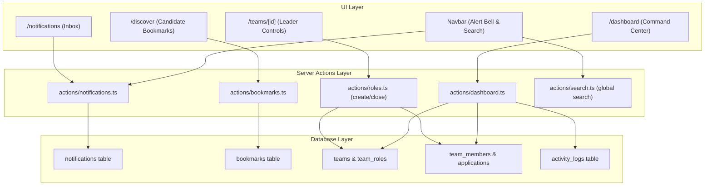
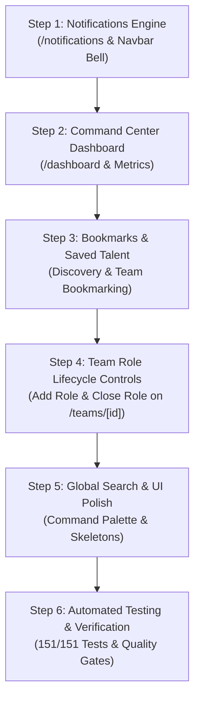

# PHASE 5 — FINAL IMPLEMENTATION PLAN & ARCHITECTURAL SPECIFICATION
### *Personal Command Center, In-App Notification System, Saved Talent/Bookmarks & Role Lifecycle Controls*

---

> [!IMPORTANT]
> **DOCUMENT STATUS: PRE-IMPLEMENTATION PLANNING FINALIZED — NOT YET IMPLEMENTED.**
> This document represents the authoritative, audited, and corrected architectural specification for Phase 5. No application code, database migrations, or production assets have been created or modified.

---

## 1. Executive Summary

With Phase 1 through Phase 4 (Steps 1–8) verified at 100% completion (133/133 automated tests passing, 16 compiled production routes, zero database drift), the core product lifecycle of **Team Discovery** is fully functional:

$$\text{DISCOVER TEAMMATES} \longrightarrow \text{FORM SQUAD} \longrightarrow \text{COLLABORATE} \longrightarrow \text{REVIEW PEERS} \longrightarrow \text{BUILD TRUST}$$

**Phase 5 transforms this foundation into a unified, daily-driver startup product** by implementing the operational command layer:
1. **Personal Command Center (`/dashboard`):** High-velocity dashboard aggregating active squad collaborations, pending applications/invitations, registered hackathons, and recent squad milestones.
2. **In-App Notification Engine (`/notifications` & Navbar Alert Bell):** Server-driven in-app notification pipeline triggered transactionally by application events, invitation responses, role auto-closures, peer reviews, and announcements (with automatic polled/revalidated unread state).
3. **Bookmarks & Saved Talent Engine (`model Bookmark`):** Bookmarking for `USER` (Candidates), `TEAM` (Squads), and `PROJECT` (Portfolio Projects).
4. **Dynamic Role Lifecycle Controls (`/teams/[id]`):** In-place role creation (`createTeamRole` modal), role closing (`closeTeamRole` with `AUTO_CLOSED` applications and `DECLINED` invitations), and leadership succession (`transferLeadership`).
5. **Global Search (`GlobalSearchDialog`):** Unified multi-entity search across Candidates, Squads, and Events with `Ctrl+K` / `Cmd+K` keyboard shortcut.
6. **Zero Database Migrations:** 100% of Phase 5 utilizes existing PostgreSQL tables (`notifications`, `bookmarks`, `activity_logs`, `team_roles`, `teams`) deployed in Phase 2/3.
7. **Exact Metric Targets:** **18 total compiled production routes** ($16 \text{ existing} + 2 \text{ new}$) and **151 / 151 automated tests** ($133 \text{ baseline} + 18 \text{ new}$).

---

## 2. Verified Phase 1–4 Baseline

An independent codebase and repository audit confirmed:
- **Framework & UI:** Next.js 16 App Router (Turbopack), Tailwind CSS v4, shadcn/ui design primitives.
- **Database:** 3 Prisma migrations applied, 0 schema drift, check constraints and partial unique indexes verified.
- **Auth & Security:** PostgreSQL RLS policies across all 27 tables, Supabase SSR Auth, Deterministic Matching Engine (`EXACT` > `RELATED` > `INTEREST_ONLY`), PostgreSQL row-level locking (`SELECT ... FOR UPDATE`).
- **Verified Workflows:**
  - Auth Screens (`/`, `/login`, `/signup`, `/verify`)
  - Profile & Portfolio (`/profile`, `/users/[id]`)
  - Teammate Discovery (`/discover`)
  - Team Catalog, Creation, Details (`/teams`, `/teams/create`, `/teams/[id]`)
  - Application & Invitation Management (`/applications`, `/invitations`)
  - Collaboration Workspace (`/teams/[id]/workspace`)
  - Peer Reviews & Event Showcase (`/events`, `/events/[id]`, Star Rating, Review Cards)
- **Quality Gates:** 0 TypeScript errors, 0 ESLint errors/warnings, 16 compiled production routes, 133/133 tests passed across 7 test suites.

---

## 3. Actual Repository Findings & Corrected Assumptions

During this planning audit, several critical architectural realities were identified and resolved:

1. **Exact Notification Server Action References:**
   - The existing invitation creation Server Action is strictly named **`createInvitation`** (`src/app/actions/invitations.ts:20`).
   - The application creation action is strictly named **`createApplication`** (`src/app/actions/applications.ts:20`).
   - All notification triggers reference these exact function names.
2. **Bookmark Supported Entities:**
   - *Schema Finding:* `enum TargetType { USER, TEAM, PROJECT }`. The `EVENT` value does **NOT** exist in the PostgreSQL enum.
   - *Resolution:* Phase 5 bookmarks strictly support `USER` (Candidates), `TEAM` (Squads), and `PROJECT` (Portfolio Projects). Event bookmarking is explicitly out of scope for Phase 5 to avoid database migrations.
3. **Notification Architecture & Realtime Terminology:**
   - *Codebase Finding:* The application uses a server-driven Next.js App Router architecture with Server Actions, optimistic UI state, and path revalidation (no persistent Supabase WebSocket listeners).
   - *Resolution:* Accurately defined as a **Server-Driven In-App Notification System** with transactional DB event creation, server-side retrieval, route revalidation, and client polling for the unread badge counter. Do NOT call this WebSocket realtime or true realtime.
4. **Close Role Lifecycle & Status Semantics:**
   - When a role is closed via `closeTeamRole`:
     - `team_roles.status` becomes `CLOSED`.
     - `applications` with `status: 'PENDING'` transition to `status: 'AUTO_CLOSED'`.
     - `invitations` with `status: 'PENDING'` transition to `status: 'DECLINED'`.
     - Team status is recalculated (if all remaining active roles are `FULL`, team transitions to `FULL`).
5. **Existing Concurrency Preservation:**
   - Adding notification creation must **NEVER** compromise the atomic row-level locks in `applications.ts`, `invitations.ts`, and `teams.ts`.

---

## 4. Phase 5 Scope Breakdown

### A. REQUIRED FOR PHASE 5 (Core Deliverables)
1. **Personal Command Center (`/dashboard`):**
   - Active Squads Grid (assigned role, squad status, direct workspace jump link).
   - Received Invitations & Sent Applications status strip with direct CTAs.
   - Registered Hackathons & Build Challenges widget with countdown timers.
   - Recent Activity Stream (milestones, peer reviews, member joins).
   - Quick Action Launchers ("Find Teammates", "Explore Events", "Form Squad").
2. **In-App Notification Engine (`/notifications` & Navbar Alert Bell):**
   - Server Actions in `src/app/actions/notifications.ts` (`getMyNotifications`, `markNotificationAsRead`, `markAllNotificationsAsRead`, `deleteNotification`, `getUnreadNotificationCount`).
   - Transactional notification generation for applications, invitations, role auto-closures, and peer endorsements.
   - Interactive `/notifications` inbox with "All" vs "Unread" filters, clear actions, and deep-linking.
   - Connected Navbar notification bell with automatically refreshed unread counter badge.
3. **Bookmarks & Saved Talent Engine (`model Bookmark`):**
   - Server Actions in `src/app/actions/bookmarks.ts` (`toggleBookmark`, `getMyBookmarks`, `checkBookmarkStatus`).
   - Bookmark toggle buttons on Candidate Discovery Cards, Public Profiles, and Team Cards.
   - "Saved Items" section on Dashboard.
4. **Dynamic Role Lifecycle & In-Page Leader Controls (`/teams/[id]`):**
   - Leader-only `+ Add Recruitment Role` modal with required skills, preferred experience, seats, and expiry.
   - `closeTeamRole` action with `AUTO_CLOSED` applications and `DECLINED` invitations.
   - Leadership Transfer modal for atomic leader succession.
5. **Global Search (`GlobalSearchDialog`):**
   - Multi-entity search across Candidates, Squads, and Events.
   - Keyboard shortcut (`Ctrl+K` / `Cmd+K`) and Navbar search trigger.
6. **Original Visual Asset:**
   - `public/images/dashboard-hero.jpg` (command center, builder metrics, velocity).
7. **Automated Test Suite:**
   - `tests/phase5_dashboard_notifications_bookmarks.test.ts` (exactly 18 automated integration test cases).
   - Expected Grand Total: **151 / 151 automated tests passing (100%)**.

### B. STRICTLY OUT OF SCOPE FOR PHASE 5
- Event Bookmarking (requires database migration to add `EVENT` to `TargetType` enum).
- Live payment gateways / ticketing systems.
- Native video conferencing / WebRTC streaming (external meeting URLs supported via workspace links).
- University administration backends (strictly preserving independent startup product identity).
- Machine learning black-box match ranking (strictly preserving deterministic skill hierarchy).

---

## 5. Database Impact & Proof of Zero Migrations

Phase 5 requires **ZERO DATABASE MIGRATIONS** because all needed models, columns, enums, and indexes were deployed in Phase 2/3:
- **`model Notification`:** `id`, `userId`, `type`, `title`, `content`, `referenceType`, `referenceId`, `isRead`, `createdAt`. Indexes on `[userId]`, `[isRead]`.
- **`model Bookmark`:** `id`, `userId`, `targetType` (`USER`, `TEAM`, `PROJECT`), `targetId`, `createdAt`. Unique compound index on `[userId, targetType, targetId]`.
- **`model ActivityLog`:** `id`, `teamId`, `userId`, `actionType`, `description`, `metadata`, `createdAt`.
- **`model TeamRole`:** `id`, `teamId`, `name`, `seatsRequired`, `preferredLevel`, `preferredExperience`, `preferredAvailability`, `expiry`, `status` (`DRAFT`, `ACTIVE`, `PARTIALLY_FILLED`, `FULL`, `CLOSED`, `EXPIRED`).

---

## 6. Detailed System Architecture



---

## 7. Server Actions API Specification

### A. Notifications API (`src/app/actions/notifications.ts`)
```typescript
export interface NotificationItem {
  id: string
  userId: string
  type: string
  title: string
  content: string
  referenceType: string
  referenceId: string
  isRead: boolean
  createdAt: Date
}

export async function getMyNotifications(
  filter?: 'ALL' | 'UNREAD'
): Promise<{ error?: string; notifications?: NotificationItem[]; unreadCount?: number }>

export async function markNotificationAsRead(
  notificationId: string
): Promise<{ error?: string; success?: boolean }>

export async function markAllNotificationsAsRead(): Promise<{ error?: string; success?: boolean }>

export async function deleteNotification(
  notificationId: string
): Promise<{ error?: string; success?: boolean }>

export async function getUnreadNotificationCount(): Promise<{ unreadCount: number }>

// Internal helper executed within transaction blocks
export async function createNotificationRecord(
  tx: any,
  data: {
    userId: string
    type: string
    title: string
    content: string
    referenceType: string
    referenceId: string
  }
): Promise<void>
```

### B. Notification Trigger Matrix (Transaction Safe)
| Event Trigger | Recipient | Type | referenceType | referenceId | Calling Server Action | Transactional? |
| :--- | :--- | :--- | :--- | :--- | :--- | :---: |
| Application Submitted | Team Leader | `APPLICATION_RECEIVED` | `TEAM` | `team.id` | `createApplication` | Yes |
| Application Accepted | Applicant | `APPLICATION_ACCEPTED` | `TEAM` | `team.id` | `acceptApplication` | Yes |
| Application Rejected | Applicant | `APPLICATION_REJECTED` | `TEAM` | `team.id` | `rejectApplication` | Yes |
| Application Auto-Closed | Applicant | `APPLICATION_AUTO_CLOSED` | `TEAM` | `team.id` | `acceptApplication` / `closeTeamRole` | Yes |
| Invitation Sent | Candidate | `INVITATION_RECEIVED` | `INVITATION` | `invitation.id` | `createInvitation` | Yes |
| Invitation Accepted | Team Leader | `INVITATION_ACCEPTED` | `TEAM` | `team.id` | `acceptInvitation` | Yes |
| Peer Review Submitted | Ratee | `RATING_RECEIVED` | `USER` | `raterId` | `submitPeerRating` | Yes |

### C. Dashboard API (`src/app/actions/dashboard.ts`)
```typescript
export interface DashboardData {
  user: {
    id: string
    name: string
    username: string
    verificationStatus: string
    avatarUrl: string | null
    availability: string
  }
  metrics: {
    activeSquadsCount: number
    pendingApplicationsCount: number
    pendingInvitationsCount: number
    savedItemsCount: number
    peerReviewsCount: number
    avgRating: number | null
  }
  activeSquads: Array<{
    id: string
    name: string
    description: string
    membershipRole: string
    memberCount: number
    event?: { id: string; name: string } | null
  }>
  pendingInvitations: Array<{
    id: string
    team: { id: string; name: string }
    role: { id: string; name: string }
    sender: { id: string; name: string; username: string }
    expiry: Date
  }>
  pendingApplications: Array<{
    id: string
    team: { id: string; name: string }
    role: { id: string; name: string }
    createdAt: Date
  }>
  registeredEvents: Array<{
    id: string
    name: string
    startDate: Date
    endDate: Date
    registrationDeadline: Date
    status: string
  }>
  recentActivity: Array<{
    id: string
    actionType: string
    description: string
    createdAt: Date
    team?: { id: string; name: string } | null
  }>
}

export async function getDashboardData(): Promise<{ error?: string; data?: DashboardData }>
```

### D. Bookmarks API (`src/app/actions/bookmarks.ts`)
```typescript
export type BookmarkTarget = 'USER' | 'TEAM' | 'PROJECT'

export async function toggleBookmark(input: {
  targetType: BookmarkTarget
  targetId: string
}): Promise<{ error?: string; isBookmarked?: boolean }>

export async function getMyBookmarks(): Promise<{
  error?: string
  bookmarks?: Array<{
    id: string
    targetType: BookmarkTarget
    targetId: string
    createdAt: Date
    targetDetails: {
      name: string
      title?: string
      subtitle?: string
      avatarUrl?: string | null
      href: string
    }
  }>
}>

export async function checkBookmarkStatus(input: {
  targetType: BookmarkTarget
  targetId: string
}): Promise<{ isBookmarked: boolean }>
```

### E. Team Role Management API (`src/app/actions/roles.ts`)
```typescript
// Existing actions reused:
// - createTeamRole
// - expireOverdueRoles

// New action added:
export async function closeTeamRole(input: {
  roleId: string
  teamId: string
}): Promise<{ error?: string; success?: boolean }>
// Logic:
// 1. Verify caller is active LEADER or CO_LEADER
// 2. Set role status to CLOSED
// 3. Auto-close remaining PENDING applications (status: AUTO_CLOSED)
// 4. Decline remaining PENDING invitations (status: DECLINED)
// 5. Recalculate team status (set to FULL if all remaining active roles are FULL)
```

### F. Global Search API (`src/app/actions/search.ts`)
```typescript
export interface SearchResults {
  candidates: Array<{ id: string; name: string; username: string; avatarUrl: string | null; topSkills: string[] }>
  teams: Array<{ id: string; name: string; description: string; openRolesCount: number }>
  events: Array<{ id: string; name: string; status: string; startDate: Date }>
}

export async function searchGlobal(query: string): Promise<{ error?: string; results?: SearchResults }>
```

---

## 8. UI & Component Architecture

### Route Hierarchy
```
src/app/(app)/
├── dashboard/
│   └── page.tsx              <-- Personal Command Center (NEW)
├── notifications/
│   └── page.tsx              <-- Notification Inbox (NEW)
├── teams/
│   └── [id]/
│       └── page.tsx          <-- Enhanced with in-page Leader Controls & Role Modal
```
**Total Routes:** 16 Existing + 2 New = **18 Compiled Routes**.

### Component Hierarchy
```
src/components/
├── dashboard/
│   ├── dashboard-client.tsx      <-- Command Center shell & metrics strip
│   ├── active-squads-card.tsx    <-- Active teams with quick workspace links
│   ├── pending-actions-strip.tsx <-- Quick accept/decline for invites & apps
│   ├── registered-events-card.tsx<-- Active hackathons & countdowns
│   └── activity-stream-card.tsx  <-- Recent squad activity
├── notifications/
│   ├── notification-inbox.tsx    <-- Filter tabs, bulk mark-as-read
│   └── notification-item.tsx     <-- Alert card with deep-link CTA
├── bookmarks/
│   ├── bookmark-button.tsx       <-- Pop/scale toggle icon button
│   └── saved-items-sheet.tsx     <-- Quick drawer of saved candidates/teams
├── teams/
│   ├── add-role-modal.tsx        <-- In-page recruitment role builder
│   ├── close-role-dialog.tsx     <-- Role termination confirmation
│   └── transfer-leader-modal.tsx <-- Safe leadership succession modal
└── search/
    └── global-search-dialog.tsx  <-- Ctrl+K command palette
```

---

## 9. Visual Assets & Micro-Interactions

### Original Visual Asset
| Asset Path | Aspect Ratio | Prompt / Description | Usage Location |
| :--- | :---: | :--- | :--- |
| `public/images/dashboard-hero.jpg` | 16:9 | Modern vector flat illustration showing a tech founder/builder command center with squad velocity analytics, collaboration feeds, and live project progress in dark blue, emerald green and slate tones | `/dashboard` Hero Header |

### Micro-Interactions & Animation Guidelines
- `motion-safe:hover:scale-105` on interactive cards and quick action triggers.
- `motion-safe:active:scale-90` on bookmark toggle buttons.
- Smooth unread notification count badge pulse on count change.
- Strict compliance with `prefers-reduced-motion` across all components.

---

## 10. Security & Privacy Model

1. **Zero Client-Trust Identity:** All mutations strictly extract authenticated user from `supabase.auth.getUser()`.
2. **Strict Ownership / Privacy:**
   - Notifications and Bookmarks query `where: { userId: authUserId }`.
   - Private candidate data (college email, ERP) is strictly excluded from dashboard, search, and bookmark responses.
3. **Role Management Authorization:** `createTeamRole`, `closeTeamRole`, and `transferLeadership` strictly verify active `LEADER` or `CO_LEADER` status.

---

## 11. Testing Strategy & Exact Test Matrix

### Test Suites Execution Plan
1. `tests/concurrency_and_transactions.test.ts` (23 tests — existing)
2. `tests/profile.test.ts` (12 tests — existing)
3. `tests/matching_and_discovery.test.ts` (11 tests — existing)
4. `tests/teams_and_applications.test.ts` (12 tests — existing)
5. `tests/applications_and_invitations.test.ts` (17 tests — existing)
6. `tests/workspace.test.ts` (25 tests — existing)
7. `tests/ratings_and_showcase.test.ts` (33 tests — existing)
8. `tests/phase5_dashboard_notifications_bookmarks.test.ts` (**exactly 18 new tests**):
   1. Notification creation on application submission
   2. Notification creation on application acceptance
   3. Notification creation on application auto-close
   4. Notification creation on invitation sending
   5. Notification creation on peer review submission
   6. `getMyNotifications` (All vs Unread filtering)
   7. `markNotificationAsRead`
   8. `markAllNotificationsAsRead`
   9. `deleteNotification`
   10. `getUnreadNotificationCount`
   11. `toggleBookmark` (Candidate)
   12. `toggleBookmark` (Team)
   13. `toggleBookmark` (Project)
   14. `getMyBookmarks` retrieval & target details mapping
   15. Duplicate bookmark prevention
   16. `getDashboardData` aggregation (metrics, squads, invites, events)
   17. `closeTeamRole` with auto-closing of pending applications (`AUTO_CLOSED`) and invitations (`DECLINED`)
   18. `searchGlobal` multi-entity discovery

**Exact Expected Total:** $133 + 18 = \mathbf{151 / 151 \text{ automated tests passing (100\%)}}$.

---

## 12. Authoritative Quality Gates

Every Phase 5 implementation step must strictly pass all 10 quality gates before being marked complete:
1. **Migration Integrity:** `npx prisma migrate status` $\rightarrow$ 3 migrations applied, 0 schema drift.
2. **Type Safety:** `npx tsc --noEmit` $\rightarrow$ 0 TypeScript errors.
3. **Lint Cleanliness:** `npx eslint src/` $\rightarrow$ 0 ESLint errors, 0 warnings.
4. **Production Build:** `npm run build` $\rightarrow$ All 18 routes compiled cleanly with Turbopack.
5. **Full Test Regression:** All 8 test suites pass (151 / 151 tests).
6. **Responsive Verification:** Tested at 375px (mobile), 768px (tablet), and 1280px (desktop).
7. **Accessibility Verification:** Semantic HTML, ARIA attributes, keyboard navigation (`Tab`, `Escape`, `Enter`, `Ctrl+K`), focus rings.
8. **Security & Privacy:** Zero client-trust identity, strict ownership checks, sensitive field redaction.
9. **Asset & Animation Verification:** Original visual asset loaded, `prefers-reduced-motion` compliance.
10. **Documentation Integrity:** Updated `PROJECT_DEVELOPMENT_LOG.md` and standalone report produced.

---

## 13. Step-by-Step Implementation Sequence



- **Step 1: Notifications Engine** (`actions/notifications.ts`, notification triggers in `applications.ts`, `invitations.ts`, `ratings.ts`, `src/app/(app)/notifications/page.tsx`, Navbar polled badge).
- **Step 2: Command Center Dashboard** (`actions/dashboard.ts`, `src/app/(app)/dashboard/page.tsx`, dashboard UI cards, `public/images/dashboard-hero.jpg`).
- **Step 3: Bookmarks Engine** (`actions/bookmarks.ts`, `bookmark-button.tsx` integrated in candidate, team, and project cards).
- **Step 4: Role Lifecycle Controls** (`closeTeamRole` action in `roles.ts`, `add-role-modal.tsx`, `close-role-dialog.tsx`, `transfer-leader-modal.tsx` on `/teams/[id]`).
- **Step 5: Global Search & Skeletons** (`actions/search.ts`, `global-search-dialog.tsx`, loading skeletons).
- **Step 6: Automated Testing & Final Verification** (`tests/phase5_dashboard_notifications_bookmarks.test.ts`, full regression execution of all 8 suites, final report).

---

## 14. Definition of Done & Checkpoint

Phase 5 will be marked complete only when:
- `/dashboard` renders live aggregated builder metrics, active squads, pending invites/applications, and registered events.
- `/notifications` handles alerts with mark-as-read and Navbar bell badge synchronization.
- Bookmarks work seamlessly for Candidates, Teams, and Projects.
- Leaders can add/close roles and transfer leadership directly on `/teams/[id]`.
- Global search enables rapid entity lookup.
- 151 / 151 automated tests pass with 100% success.
- Production build compiles all 18 routes cleanly with zero TypeScript/ESLint errors.

**Current State:** PHASE 5 FINAL PLANNING CORRECTION COMPLETE — IMPLEMENTATION NOT STARTED — AWAITING APPROVAL.
