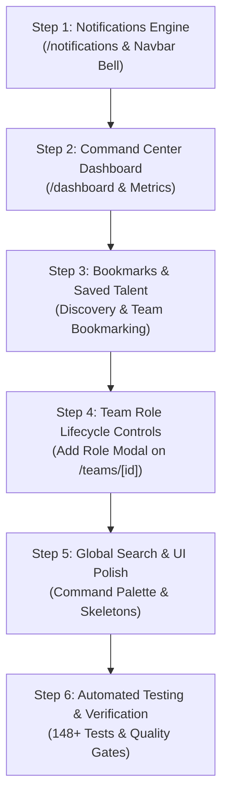

# PHASE 5 — IMPLEMENTATION PLAN & ARCHITECTURAL SPECIFICATION
### *Personal Command Center, In-App Notification System, Saved Talent/Bookmarks & Lifecycle Polish*

---

> [!IMPORTANT]
> **DOCUMENT STATUS: PRE-IMPLEMENTATION PLANNING ONLY — NOT YET IMPLEMENTED.**
> This document defines the exact architecture, security model, data flow, component hierarchy, test matrix, and step-by-step implementation sequence for Phase 5. No application code, database migrations, or production assets have been created or modified.

---

## 1. Executive Summary

With Phase 1 through Phase 4 (Steps 1–8) verified at 100% completion (133/133 automated tests passing, 16 compiled production routes, zero database drift), the core product lifecycle of **Team Discovery** is fully functional:

$$\text{DISCOVER TEAMMATES} \longrightarrow \text{FORM SQUAD} \longrightarrow \text{COLLABORATE} \longrightarrow \text{REVIEW PEERS} \longrightarrow \text{BUILD TRUST}$$

However, critical command-and-control, real-time alert, and workflow management capabilities are required to transform this foundation into a unified, daily-driver startup product. 

**Phase 5 delivers:**
1. **Personal Command Center (`/dashboard`):** A high-velocity personal hub aggregating active squad collaborations, pending incoming/outgoing applications, received invitations, registered hackathons, and recent squad milestones.
2. **In-App Notification System (`/notifications` & Navbar Live Bell):** Real-time alert notifications triggered by team applications, invitation responses, role auto-closures, peer reviews, and announcements.
3. **Bookmarks & Saved Talent Engine (`model Bookmark`):** Ability for team leaders to save high-potential candidates during discovery, and for candidates to bookmark squads and events.
4. **Dynamic Role Lifecycle & In-Page Leader Controls (`/teams/[id]`):** In-place role creation (`createTeamRole` modal), role closing (`closeTeamRole`), and atomic leadership transfer directly from the team detail page.
5. **System-Wide Polish & Global Search:** Global search across skills, squads, and events, unified loading skeletons, and interactive feedback.
6. **Zero Database Migrations:** 100% of Phase 5 utilizes existing PostgreSQL tables (`notifications`, `bookmarks`, `activity_logs`, `team_roles`, `teams`) already deployed in Phase 2/3.

---

## 2. Current Verified Baseline (Source of Truth)

An independent codebase and repository audit confirmed:
- **Phase 1 (Foundation):** Next.js 16 App Router (Turbopack), Tailwind CSS v4, shadcn/ui.
- **Phase 2 (Database):** 3 Prisma migrations applied, 0 schema drift, check constraints and partial unique indexes verified.
- **Phase 3 (Core Backend):** PostgreSQL RLS policies across all tables, Supabase SSR Auth, Deterministic Matching Engine Core (`EXACT` > `RELATED` > `INTEREST_ONLY`), PostgreSQL row-level locking (`SELECT ... FOR UPDATE`) in concurrency actions.
- **Phase 4 (Product Workflows):**
  - Step 1: UI Foundation, Navbar, Sidebar, MobileNav, App Shell.
  - Step 2: Auth Screens (`/`, `/login`, `/signup`, `/verify`).
  - Step 3: Profile & Portfolio (`/profile`, `/users/[id]`).
  - Step 4: Teammate Discovery (`/discover`).
  - Step 5: Team Catalog, Creation, Details (`/teams`, `/teams/create`, `/teams/[id]`).
  - Step 6: Application & Invitation Management (`/applications`, `/invitations`).
  - Step 7: Collaboration Workspace (`/teams/[id]/workspace`).
  - Step 8: Peer Reviews & Event Showcase (`/events`, `/events/[id]`, Star Rating, Review Cards).
- **Quality Gates:** 0 TypeScript errors, 0 ESLint errors/warnings, 16 compiled production routes, 133/133 tests passed across 7 test suites.

---

## 3. Gaps & Problems Identified

| Gap Area | Current Limitation | Phase 5 Resolution |
| :--- | :--- | :--- |
| **Missing `/dashboard` Route** | Sidebar and Navbar link to `/dashboard`, but route returns 404 / redirect | Implement `/dashboard` with active squads, pending invites, registered events, and quick action shortcuts |
| **Unconnected Notifications** | `Notification` table exists in DB, but has no UI or Server Actions | Implement `/notifications` inbox, unread badge counters, mark-as-read actions, and auto-notification generation |
| **Unconnected Bookmarks** | `Bookmark` table exists in DB, but has no UI or Server Actions | Implement `toggleBookmark`, bookmark buttons on candidate & team cards, and saved items tab |
| **Team Role Management Gap** | Leaders cannot add roles directly on `/teams/[id]` without recreating team | Implement in-page `Add Role Modal`, role status toggles, and leadership transfer controls |
| **Navbar Notification Bell** | Bell icon is static with dummy badge | Connect bell to real unread notification count and quick dropdown preview |

---

## 4. Phase 5 Scope Breakdown

### A. REQUIRED FOR PHASE 5 (Core Deliverables)
1. **Personal Command Center (`/dashboard`):**
   - Active Squads Grid (role, squad status, quick link to `/teams/[id]/workspace`).
   - Received Invitations & Sent Applications status strip with direct CTAs.
   - Registered Events & Hackathons widget with countdown timers.
   - Recent Activity Stream (milestones, peer reviews, new squad members).
   - Quick Action Launchers ("Find Teammates", "Explore Events", "Form Squad").
2. **In-App Notification Engine (`/notifications` & Navbar Integration):**
   - Server Actions in `src/app/actions/notifications.ts` (`getMyNotifications`, `markNotificationAsRead`, `markAllNotificationsAsRead`, `deleteNotification`, `getUnreadNotificationCount`).
   - Automated notification triggers during Application submission, Acceptance/Rejection, Invitation sending, Role Auto-Closure, and Peer Review submission.
   - Interactive `/notifications` inbox with "All" vs "Unread" tabs, clear actions, and direct deep links.
   - Navbar live unread counter badge.
3. **Bookmarks & Saved Talent Engine (`model Bookmark`):**
   - Server Actions in `src/app/actions/bookmarks.ts` (`toggleBookmark`, `getMyBookmarks`, `checkBookmarkStatus`).
   - Bookmark toggle buttons on Candidate Discovery Cards, Public Profiles, Team Cards, and Event Cards.
   - "Saved Items" tab on Dashboard / Profile.
4. **Dynamic In-Page Team Management (`/teams/[id]`):**
   - Leader-only `+ Add Recruitment Role` modal with required skills, preferred experience, seats, and expiry.
   - Role close/expire action.
   - Leadership Transfer modal for atomic leader succession.
5. **Original Visual Asset:**
   - `public/images/dashboard-hero.jpg` (command center, builder metrics, velocity).
6. **Automated Test Suite:**
   - `tests/dashboard_and_notifications.test.ts` (15+ automated integration test cases).
   - All 133 existing tests must remain 100% passing (total 148+ tests).

### B. RECOMMENDED BUT OPTIONAL (Secondary Polish)
- Global Search keyboard shortcut (`Ctrl+K` / `Cmd+K` command palette for quick navigation to teams, candidates, and events).
- Micro-haptic toast sounds / subtle animations on bookmark and notification actions.

### C. STRICTLY OUT OF SCOPE FOR PHASE 5
- Live payment gateways / ticketing systems.
- Native video conferencing / WebRTC streaming (external meeting URLs supported via workspace links).
- University administration backends (strictly preserving independent startup product identity).
- Machine learning black-box match ranking (strictly preserving deterministic skill hierarchy).

---

## 5. Phase 5 Architecture Plan

### System Component Diagram
```
                     +---------------------------------------+
                     |         App Shell & Navigation        |
                     |  Navbar (Live Bell) | Sidebar | Nav   |
                     +-------------------+-------------------+
                                         |
         +-------------------------------+-------------------------------+
         |                               |                               |
         v                               v                               v
+------------------+           +--------------------+          +------------------+
|   /dashboard     |           |   /notifications   |          |  /teams/[id]     |
| Command Center   |           | Notification Inbox |          | Leader Controls  |
| - Active Squads  |           | - Unread Filters   |          | - Add Role Modal |
| - Pending Invites|           | - Mark Read / Clear|          | - Close Role     |
| - Event Deadlines|           | - Deep Links       |          | - Transfer Lead  |
+--------+---------+           +---------+----------+          +--------+---------+
         |                               |                              |
         +-------------------------------+------------------------------+
                                         |
                                         v
                     +---------------------------------------+
                     |         Server Actions Layer          |
                     | - actions/dashboard.ts                |
                     | - actions/notifications.ts            |
                     | - actions/bookmarks.ts                |
                     | - actions/teams.ts & roles.ts         |
                     +-------------------+-------------------+
                                         |
                                         v
                     +---------------------------------------+
                     |    Supabase SSR Auth (getUser())      |
                     |   PostgreSQL + Prisma 7 ORM (DB)      |
                     |  [users, notifications, bookmarks,    |
                     |   teams, team_roles, activity_logs]   |
                     +---------------------------------------+
```

---

## 6. Server Actions & API Design

### A. Notifications API (`src/app/actions/notifications.ts`)
```typescript
export interface NotificationData {
  id: string
  userId: string
  type: string
  title: string
  content: string
  referenceType: string
  referenceId: string
  isRead: boolean
  createdAt: Date
}

// 1. Fetch notifications for authenticated user
export async function getMyNotifications(
  filter?: 'ALL' | 'UNREAD'
): Promise<{ error?: string; notifications?: NotificationData[]; unreadCount?: number }>

// 2. Mark single notification as read
export async function markNotificationAsRead(
  notificationId: string
): Promise<{ error?: string; success?: boolean }>

// 3. Mark all notifications as read
export async function markAllNotificationsAsRead(): Promise<{ error?: string; success?: boolean }>

// 4. Delete notification
export async function deleteNotification(
  notificationId: string
): Promise<{ error?: string; success?: boolean }>

// 5. Get lightweight unread count for Navbar
export async function getUnreadNotificationCount(): Promise<{ unreadCount: number }>

// 6. Internal Helper: Create notification (invoked by existing actions)
export async function createInternalNotification(
  data: {
    userId: string
    type: string
    title: string
    content: string
    referenceType: string
    referenceId: string
  },
  tx?: any
): Promise<void>
```

### B. Dashboard API (`src/app/actions/dashboard.ts`)
```typescript
export interface DashboardData {
  user: {
    id: string
    name: string
    username: string
    verificationStatus: string
    avatarUrl: string | null
    availability: string
  }
  metrics: {
    activeSquadsCount: number
    pendingApplicationsCount: number
    pendingInvitationsCount: number
    savedItemsCount: number
    peerReviewsCount: number
    avgRating: number | null
  }
  activeSquads: Array<{
    id: string
    name: string
    description: string
    membershipRole: string
    memberCount: number
    event?: { id: string; name: string } | null
  }>
  pendingInvitations: Array<{
    id: string
    team: { id: string; name: string }
    role: { id: string; name: string }
    sender: { id: string; name: string; username: string }
    expiry: Date
  }>
  pendingApplications: Array<{
    id: string
    team: { id: string; name: string }
    role: { id: string; name: string }
    createdAt: Date
  }>
  registeredEvents: Array<{
    id: string
    name: string
    startDate: Date
    endDate: Date
    registrationDeadline: Date
    status: string
  }>
  recentActivity: Array<{
    id: string
    actionType: string
    description: string
    createdAt: Date
    team?: { id: string; name: string } | null
  }>
}

export async function getDashboardData(): Promise<{ error?: string; data?: DashboardData }>
```

### C. Bookmarks API (`src/app/actions/bookmarks.ts`)
```typescript
export type BookmarkTargetType = 'USER' | 'TEAM' | 'PROJECT'

export async function toggleBookmark(input: {
  targetType: BookmarkTargetType
  targetId: string
}): Promise<{ error?: string; isBookmarked?: boolean }>

export async function getMyBookmarks(): Promise<{
  error?: string
  bookmarks?: Array<{
    id: string
    targetType: BookmarkTargetType
    targetId: string
    createdAt: Date
    targetDetails: any
  }>
}>

export async function checkBookmarkStatus(input: {
  targetType: BookmarkTargetType
  targetId: string
}): Promise<{ isBookmarked: boolean }>
```

---

## 7. Step-by-Step Implementation Sequence



### Step 1: Notifications Engine & Navbar Live Alert Bell
- **Objective:** Deploy full in-app notification infrastructure and connect the Navbar bell.
- **Backend:** Create `src/app/actions/notifications.ts`. Connect internal notifications to `applications.ts` (application received, accepted, auto-closed), `invitations.ts` (invitation received, accepted), and `ratings.ts` (peer review received).
- **Frontend:** Create `src/components/notifications/notification-list.tsx`, `src/components/notifications/notification-item.tsx`, and `src/app/(app)/notifications/page.tsx`. Update `src/components/layout/navbar.tsx` with live unread badge.
- **Tests:** Notification creation, mark as read, mark all as read, delete, unread count accuracy.

### Step 2: Personal Command Center Dashboard (`/dashboard`)
- **Objective:** Implement the primary authenticated landing dashboard.
- **Backend:** Create `src/app/actions/dashboard.ts` aggregating user metrics, active squads, pending invites, pending applications, registered events, and recent activity logs.
- **Frontend:** Create `src/components/dashboard/dashboard-client.tsx`, `active-squads-card.tsx`, `quick-actions-card.tsx`, `activity-stream-card.tsx`, and `src/app/(app)/dashboard/page.tsx`.
- **Visual Asset:** Generate `public/images/dashboard-hero.jpg`.
- **Tests:** Dashboard aggregation accuracy, active squads filtering, unauthorized rejection.

### Step 3: Bookmarks & Saved Talent Engine
- **Objective:** Allow recruiters and candidates to bookmark and retrieve high-value opportunities.
- **Backend:** Create `src/app/actions/bookmarks.ts`.
- **Frontend:** Create `src/components/bookmarks/bookmark-button.tsx` and integrate into `candidate-card.tsx`, `user-profile`, and `team-card.tsx`. Add "Saved Items" section to Dashboard.
- **Tests:** Toggle bookmark, duplicate prevention (unique compound index), delete bookmark, unauthorized rejection.

### Step 4: Dynamic Role Lifecycle & In-Page Leader Controls
- **Objective:** Give team leaders full in-place recruitment control on `/teams/[id]`.
- **Backend:** Wire existing `createTeamRole`, `closeTeamRole`, and `transferLeadership` actions from `teams.ts` / `roles.ts`.
- **Frontend:** Create `src/components/teams/add-role-modal.tsx`, `close-role-dialog.tsx`, and `transfer-leader-modal.tsx`. Integrate into `src/app/(app)/teams/[id]/page.tsx`.
- **Tests:** Add role to active team, close role with auto-cancellation, transfer leadership atomically.

### Step 5: Global Search & UI Polish
- **Objective:** Provide global discovery and polish all empty, loading, and error states.
- **Frontend:** Global search bar in Navbar/App Shell, unified loading skeletons for dashboard, notifications, and teams.
- **Verification:** Responsive testing across 375px, 768px, 1280px; accessibility ARIA validation.

### Step 6: Automated Testing, Full Regression & Final Verification
- **Objective:** Run complete automated test suite and enforce all 10 quality gates.
- **Tests:** Create `tests/dashboard_and_notifications.test.ts` (15+ test cases). Execute all 8 test suites. Target: **148+ / 148+ tests passed (100%)**.
- **Quality Gates:** `npx prisma migrate status` (0 drift), `npx tsc --noEmit` (0 errors), `npx eslint src/` (0 warnings), `npm run build` (clean build).

---

## 8. Visual Design & Image Requirements

### Startup Brand Identity
- The platform is **"Team Discovery"** — an independent tech startup product.
- **Zero university-specific branding:** No hardcoded college logos or college-portal styling.
- Visual theme: Modern dark-mode optimized palette (Emerald Green `#10B981`, Deep Indigo/Slate `#0F172A`, Amber `#F59E0B`).

### Visual Asset Specification
| Asset Path | Aspect Ratio | Description | Usage Location |
| :--- | :---: | :--- | :--- |
| `public/images/dashboard-hero.jpg` | 16:9 | High-tech vector flat illustration showing a software builder dashboard, project velocity charts, collaborative squad indicators, and live notification streams | `/dashboard` Hero Header |

---

## 9. Animation & Micro-Interaction Guidelines

All animations must use `motion-safe:` and respect `prefers-reduced-motion`:
- **Notification Dropdown / List:** Subtle slide-down and fade-in (`motion-safe:animate-in fade-in slide-in-from-top-2 duration-200`).
- **Bookmark Toggle:** Smooth pop/scale micro-interaction (`motion-safe:active:scale-90 transition-transform`).
- **Dashboard Metric Cards:** Hover elevation and subtle border glow (`transition-all duration-200 hover:shadow-md hover:border-primary/40`).
- **Loading Skeletons:** Gentle pulse animation (`animate-pulse bg-muted/60`).

---

## 10. Security & Privacy Model

1. **Strict Server-Side Auth:** All Phase 5 Server Actions (`notifications.ts`, `dashboard.ts`, `bookmarks.ts`, `teams.ts`) strictly retrieve identity from `supabase.auth.getUser()`. Zero caller-provided `userId` parameters permitted.
2. **Data Isolation:** Notifications and Bookmarks strictly query `where: { userId: authUserId }`. Cross-user data leakage is impossible.
3. **Leader Permission Checks:** Role creation and leadership transfer verify that the caller holds active `LEADER` or `CO_LEADER` status in the team.
4. **Privacy Protection:** Dashboard queries strictly omit private fields (`collegeEmail`, `erp`).

---

## 11. Mandatory Quality Gates

Every Phase 5 step must satisfy all 10 quality gates before completion:
1. `npx prisma migrate status` $\rightarrow$ 3 migrations applied, 0 schema drift.
2. `npx tsc --noEmit` $\rightarrow$ 0 TypeScript errors.
3. `npx eslint src/` $\rightarrow$ 0 ESLint errors, 0 warnings.
4. `npm run build` $\rightarrow$ Clean Next.js 16 production build with all routes compiled.
5. `tests/concurrency_and_transactions.test.ts` $\rightarrow$ 23/23 PASSED.
6. `tests/profile.test.ts` $\rightarrow$ 12/12 PASSED.
7. `tests/matching_and_discovery.test.ts` $\rightarrow$ 11/11 PASSED.
8. `tests/teams_and_applications.test.ts` $\rightarrow$ 12/12 PASSED.
9. `tests/applications_and_invitations.test.ts` $\rightarrow$ 17/17 PASSED.
10. `tests/workspace.test.ts` $\rightarrow$ 25/25 PASSED.
11. `tests/ratings_and_showcase.test.ts` $\rightarrow$ 33/33 PASSED.
12. `tests/dashboard_and_notifications.test.ts` $\rightarrow$ 15+/15+ PASSED.
13. Responsive validation: 375px mobile, 768px tablet, 1280px desktop.
14. Accessibility validation: ARIA labels, keyboard controls, focus traps.

---

## 12. Files Expected to be Created / Modified

### Files to Create:
1. `src/app/actions/notifications.ts`
2. `src/app/actions/dashboard.ts`
3. `src/app/actions/bookmarks.ts`
4. `src/components/notifications/notification-list.tsx`
5. `src/components/notifications/notification-item.tsx`
6. `src/components/dashboard/dashboard-client.tsx`
7. `src/components/dashboard/active-squads-card.tsx`
8. `src/components/dashboard/quick-actions-card.tsx`
9. `src/components/dashboard/activity-stream-card.tsx`
10. `src/components/bookmarks/bookmark-button.tsx`
11. `src/components/teams/add-role-modal.tsx`
12. `src/components/teams/transfer-leader-modal.tsx`
13. `src/app/(app)/dashboard/page.tsx`
14. `src/app/(app)/notifications/page.tsx`
15. `public/images/dashboard-hero.jpg`
16. `tests/dashboard_and_notifications.test.ts`

### Files to Modify:
1. `src/components/layout/navbar.tsx` (connect live unread notification count)
2. `src/components/discovery/candidate-card.tsx` (add bookmark button)
3. `src/components/teams/team-card.tsx` (add bookmark button)
4. `src/app/(app)/teams/[id]/page.tsx` (integrate in-page leader controls & role creation)
5. `PROJECT_DEVELOPMENT_LOG.md` (record progress per step)

---

## 13. Definition of Done & Recommendation

Phase 5 will be considered complete when:
- `/dashboard` is fully operational and renders aggregated builder metrics, active squads, pending invites/applications, and registered events.
- `/notifications` is fully operational with real-time alerts, mark-as-read workflows, and Navbar bell integration.
- Bookmarks engine is fully wired for candidates and teams.
- Leaders can dynamically manage roles and transfer leadership directly on `/teams/[id]`.
- 148+ automated tests pass with 100% success.
- Production build compiles all routes cleanly with zero TypeScript/ESLint errors.

**Recommendation:** Approve `PHASE_5_IMPLEMENTATION_PLAN.md` to begin Phase 5 Step 1 (In-App Notifications Engine & Alert Inbox).
