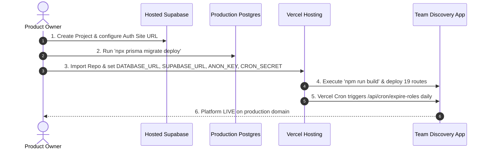

# PRODUCTION READINESS — STEP 3
## PRODUCTION INFRASTRUCTURE & DEPLOYMENT VERIFICATION REPORT

---

### 1. Intended Hosting Architecture
- **Web & Application Runtime:** Next.js 16 (App Router) hosted on **Vercel** or a standard **Node.js 20+ / Docker container** platform.
- **Database Layer:** PostgreSQL 15+ hosted on **Supabase** (or any managed PostgreSQL service), utilizing Supabase's built-in **Transaction Connection Pooler** (port 6543) or Session Pooler (port 5432) with SSL (`?sslmode=require&pgbouncer=true`).
- **Authentication & Realtime Service:** **Supabase Auth** with Server-Side Rendering (`@supabase/ssr`) managing session tokens via HTTP-only secure cookies and automatic token refresh via Next.js Middleware.
- **Scheduled Maintenance / Cron:** **Vercel Cron** (configured in [`vercel.json`](file:///m:/Team%20Discovery/team-discovery/vercel.json)) triggering the protected `/api/cron/expire-roles` endpoint daily.

#### Hosting Status Distinction:
$$\begin{array}{|c|c|c|}
\hline
\textbf{Status Category} & \textbf{Current State} & \textbf{Details} \\
\hline
\text{Production Code Ready} & \textbf{YES (100\%)} & \text{All 19 routes compiled, 0 TS/ESLint errors, 315/315 tests passing} \\
\text{Infrastructure Configured} & \textbf{PENDING USER ACTION} & \text{Live Supabase project \& Vercel project to be linked by user} \\
\text{Actually Deployed} & \textbf{NO (NOT YET DEPLOYED)} & \text{Awaiting user approval \& manual production credentials} \\
\hline
\end{array}$$

---

### 2. Environment Configuration
The application configuration template is strictly documented in [`.env.example`](file:///m:/Team%20Discovery/team-discovery/.env.example). The following variables must be provisioned in the hosting provider's environment settings:

| Variable Name | Scope | Sensitivity | Purpose & Format |
| :--- | :---: | :---: | :--- |
| `DATABASE_URL` | Server Only | **Secret** | `postgresql://postgres.[REF]:[PASSWORD]@[HOST]:6543/postgres?sslmode=require&pgbouncer=true` |
| `NEXT_PUBLIC_SUPABASE_URL` | Client & Server | Public Safe | `https://[PROJECT-REF].supabase.co` |
| `NEXT_PUBLIC_SUPABASE_ANON_KEY` | Client & Server | Public Safe | `eyJhbGciOi...` (Public anon token from Supabase Project Settings $\rightarrow$ API) |
| `CRON_SECRET` | Server Only | **Secret** | 32+ character random string (e.g. `openssl rand -base64 32`) |
| `NODE_ENV` | Runtime | Non-sensitive | `"production"` (automatically set by Vercel) |

*Security Confirmation: Real secrets and `.env` remain gitignored and are never committed to version control.*

---

### 3. Supabase Production Requirements
To prepare a hosted Supabase project for Team Discovery:
1. **Create Project:** Provision a new Supabase project in the desired cloud region.
2. **Auth Settings Configuration:**
   - **Site URL:** Set to production custom domain (e.g. `https://teamdiscovery.app`).
   - **Redirect URLs:** Whitelist `https://teamdiscovery.app/**`, `https://teamdiscovery.app/verify`, `https://teamdiscovery.app/login`.
   - **Auth Providers:** Enable Email/Password authentication.
3. **Database Connectivity:**
   - Obtain the **Connection String (Transaction Pooler - Port 6543)** with `?sslmode=require&pgbouncer=true` from Supabase Settings $\rightarrow$ Database.
4. **Auth $\rightarrow$ Database User Sync:**
   - Supabase Auth creates user records in `auth.users`. When a candidate registers, application Server Actions insert and manage corresponding records in `public.users` and `public.user_private`.

---

### 4. Database Deployment Requirements
- **Prisma Migrations:** The schema is fully version-controlled across 3 migrations in `prisma/migrations/`.
- **Production Migration Execution Command:**
  ```bash
  npx prisma migrate deploy
  ```
  *(To be executed in CI/CD pipeline or manually against the live production database before the first deployment).*
- **Seed Policy:** **DO NOT RUN `prisma db seed` IN PRODUCTION**. Demo/mock accounts (`admin@git.edu`, `john.doe@git.edu`) are strictly for local testing.
- **Backup & Disaster Recovery:** Enable automated daily backups and Point-In-Time-Recovery (PITR) in the Supabase Dashboard prior to launch.

---

### 5. Cron Deployment Requirements
- **Endpoint:** `/api/cron/expire-roles`
- **Configuration:** Defined in [`vercel.json`](file:///m:/Team%20Discovery/team-discovery/vercel.json):
  ```json
  {
    "crons": [
      {
        "path": "/api/cron/expire-roles",
        "schedule": "0 0 * * *"
      }
    ]
  }
  ```
- **Security Validation:**
  - The route requires `Authorization: Bearer <CRON_SECRET>` or `x-cron-secret: <CRON_SECRET>`.
  - In production mode (`NODE_ENV === 'production'`), requests without a valid matching `CRON_SECRET` are immediately rejected with `401 Unauthorized`.
  - The job reuses `expireOverdueRoles()`, updating expired roles to `EXPIRED` and cascading `AUTO_CLOSED` to competing pending applications.

---

### 6. Domain & URL Configuration
During deployment, the user must provide and configure the following URLs:
- **Custom Domain:** e.g. `teamdiscovery.app` (or Vercel default domain `*.vercel.app`).
- **DNS Records:** Configure CNAME / A records pointing to `cname.vercel-dns.com` or platform load balancer.
- **SSL / TLS:** Managed automatically by Vercel / Cloudflare with Let's Encrypt certificates.
- **Zero Localhost Dependencies:** Verified that no hardcoded `localhost` URLs exist in redirect flows or API calls.

---

### 7. Production Security Configuration
- **Cookie Security:** Auth session cookies use `@supabase/ssr` with `HttpOnly`, `SameSite=Lax`, and `Secure` attributes automatically enabled over HTTPS.
- **Test Override Elimination:** In production (`NODE_ENV === 'production'`), all Server Actions strictly ignore client-supplied `userId` parameters and require server-side authenticated sessions.
- **Private Data Isolation:** Private applicant fields (`collegeEmail`, `erp`, verification docs) and private projects (`isPrivate: true`) are excluded from public search and profile projections.
- **Error Sanitization:** Server Actions catch internal database exceptions, log them to server stderr, and return safe client-facing messages (`{ error: 'An unexpected error occurred...' }`) without exposing database schemas or stack traces.

---

### 8. Build Verification

```
▲ Next.js 16.3.1 (Turbopack)
- Environments: .env
✓ Running next.config.ts took 36ms
✓ Compiled successfully in 3.3s
✓ Finished TypeScript in 2.9s
✓ Generating static pages (11/11) in 633ms
✓ Finalizing page optimization
```

**Compiled Production Routes (19):**
- `○ /` (Static Landing Page)
- `○ /_not-found` (Static 404)
- `ƒ /api/cron/expire-roles` (Dynamic Scheduled API Endpoint)
- `ƒ /applications` (Dynamic Applications Hub)
- `ƒ /dashboard` (Dynamic Personal Command Center)
- `ƒ /discover` (Dynamic Teammate Matching Engine)
- `ƒ /events` (Dynamic Event Catalog)
- `ƒ /events/[id]` (Dynamic Event Showcase)
- `ƒ /invitations` (Dynamic Invitations Inbox)
- `○ /login` (Static Login)
- `ƒ /notifications` (Dynamic Notifications Center)
- `ƒ /profile` (Dynamic User Profile Management)
- `○ /signup` (Static Registration)
- `ƒ /teams` (Dynamic Squads Catalog)
- `ƒ /teams/[id]` (Dynamic Squad Details & Role Management)
- `ƒ /teams/[id]/workspace` (Dynamic Private Squad Workspace)
- `ƒ /teams/create` (Dynamic Squad Creation Wizard)
- `ƒ /users/[id]` (Dynamic Candidate Portfolio)
- `ƒ /verify` (Dynamic Verification Request)

---

### 9. Test Verification Matrix (100% PASS)

| Test Suite | File | Test Count | Result |
| :--- | :--- | :---: | :---: |
| 1 | `tests/concurrency_and_transactions.test.ts` | 23 | **PASS** |
| 2 | `tests/profile.test.ts` | 12 | **PASS** |
| 3 | `tests/matching_and_discovery.test.ts` | 11 | **PASS** |
| 4 | `tests/teams_and_applications.test.ts` | 12 | **PASS** |
| 5 | `tests/applications_and_invitations.test.ts` | 17 | **PASS** |
| 6 | `tests/workspace.test.ts` | 25 | **PASS** |
| 7 | `tests/ratings_and_showcase.test.ts` | 33 | **PASS** |
| 8 | `tests/notifications.test.ts` | 28 | **PASS** |
| 9 | `tests/dashboard.test.ts` | 44 | **PASS** |
| 10 | `tests/bookmarks.test.ts` | 33 | **PASS** |
| 11 | `tests/role_lifecycle.test.ts` | 33 | **PASS** |
| 12 | `tests/search.test.ts` | 30 | **PASS** |
| 13 | `tests/cron_and_environment_hardening.test.ts` | 14 | **PASS** |
| **GRAND TOTAL** | **13 Comprehensive Suites** | **315** | **315 / 315 Passed (100%)** |

---

### 10. Deployment Dry-Run Result
- **Build Dry Run:** Succeeded with 0 errors and 0 warnings.
- **Route Tree:** All 18 App Router pages + 1 Cron API route generated properly.
- **Environment Schema:** `.env.example` verified against all code `process.env` calls.
- **Prisma Schema:** Up to date with 3 applied migrations and 0 drift.
- **Security Check:** Zero exposed secrets, zero client-trusted user ID vulnerabilities in production mode.

---

### 11. Remaining Manual Actions for User
Before initiating the live production deployment, the user needs to:
1. Create a production Supabase project at [supabase.com](https://supabase.com).
2. Copy the production `DATABASE_URL` (port 6543 pooler), `NEXT_PUBLIC_SUPABASE_URL`, and `NEXT_PUBLIC_SUPABASE_ANON_KEY`.
3. Generate a 32-character random string for `CRON_SECRET`.
4. Run `npx prisma migrate deploy` pointing to the live Supabase database.
5. Link the GitHub repository to Vercel and input the 4 environment variables into Vercel Project Settings.
6. Trigger the initial Vercel production deployment.

---

### 12. Deployment Blockers
- **Technical Blockers:** **NONE (0)**. The codebase is 100% production-ready.
- **External Dependencies:** Awaiting user creation of live hosted Supabase project and Vercel environment variable configuration.

---

### 13. Exact Step-by-Step Deployment Sequence



---

### 14. Verification Sign-Off
- **Status:** **PRODUCTION CODE READY — AWAITING LIVE HOSTING PROVISIONING BY USER**.
- **Destructive Actions:** Zero live databases touched, zero demo data seeded, zero premature deployments executed.
